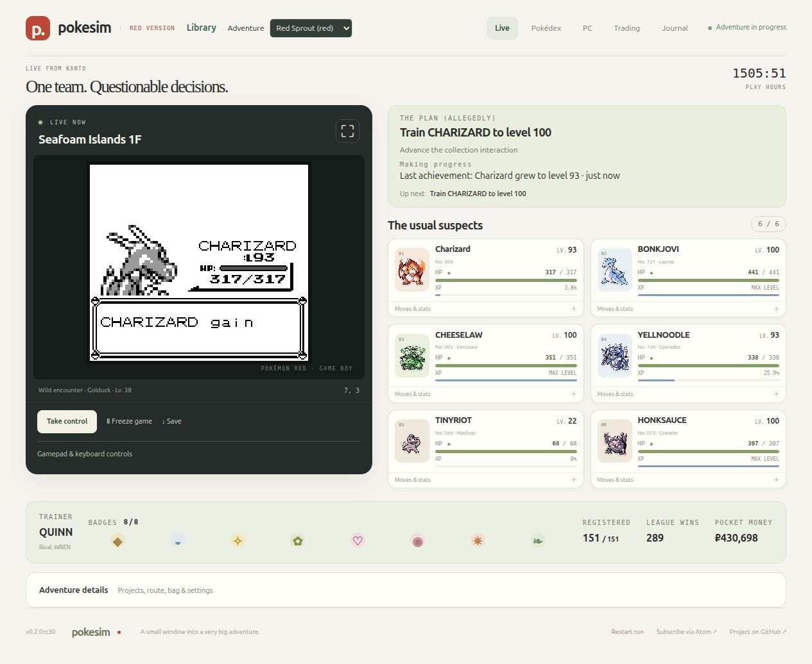
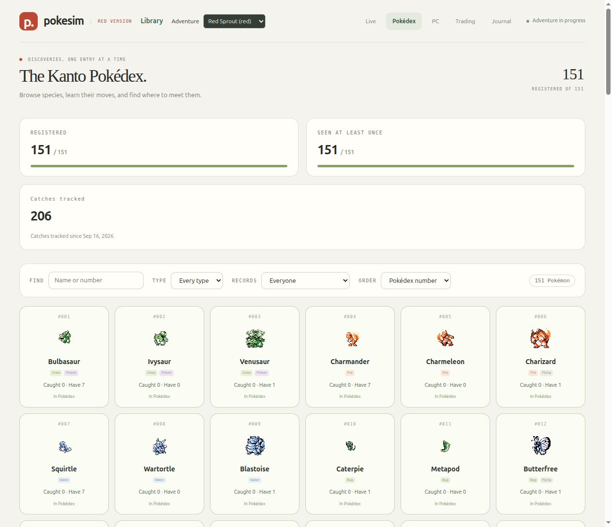
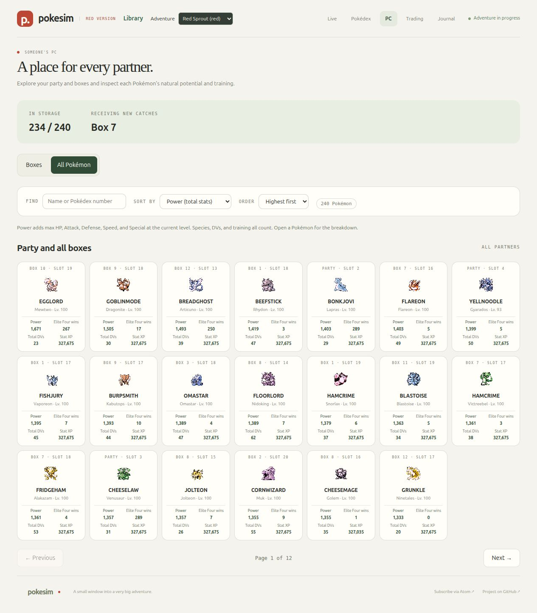
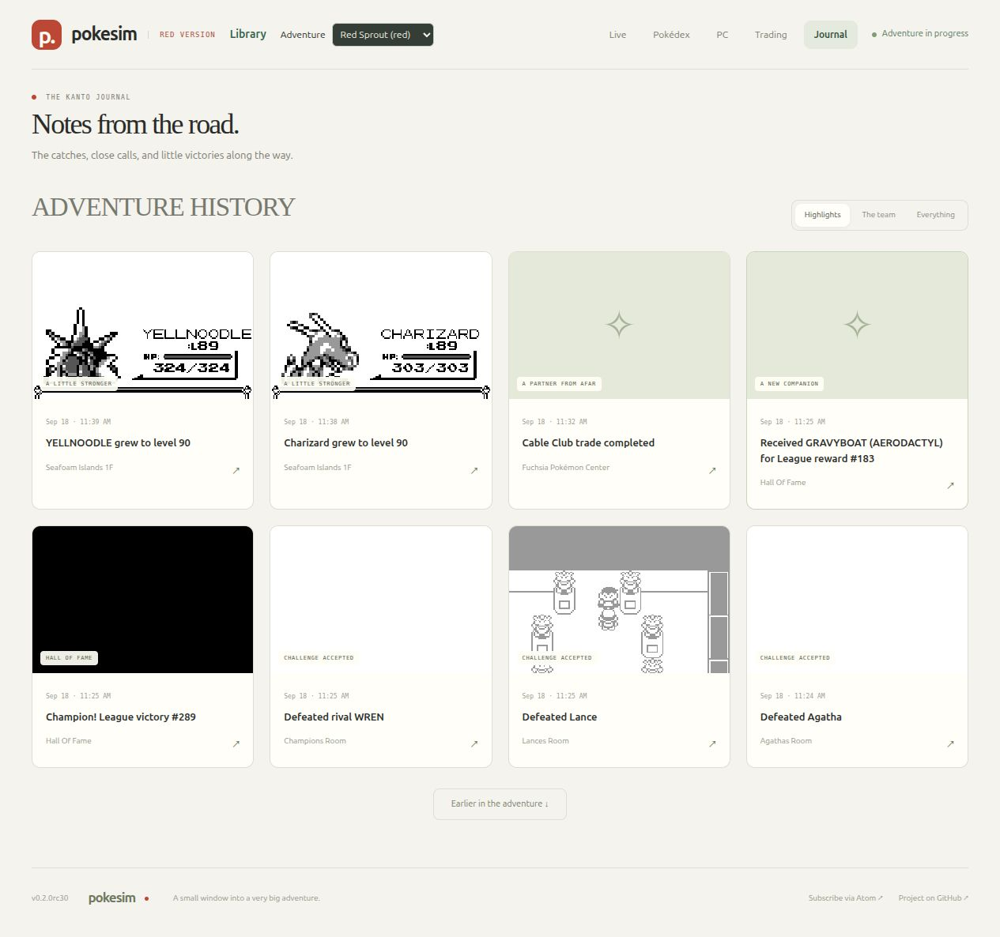

# PokeSim

### A little Pokémon adventure that keeps going while you're away.

Leave Kanto running on your desktop or server. Come back to a new catch, an evolved teammate, or a gym badge you weren't there to see. PokeSim plays Pokémon Red for you, with a live browser view that lets you follow the journey and take the controls whenever you feel like it.

Pick a favorite. Question its battle decisions. Get surprisingly attached to a Lapras named BONKJOVI.

**Desktop or server · Automatic play · Browser controls · Your own ongoing adventure**

[Take a look](#a-window-into-kanto) · [Make-it-yours options](#your-adventure-your-pace) · [Run your own](#run-your-own-adventure)



*Charizard is chasing level 100. BONKJOVI is already there. The adventure keeps going.*

**Screenshot preview:** these are real captures from our running development build,
which includes features ahead of the rc31 download. The optional Pokémon portraits
are supplied locally and are not bundled. Click any image to see it at full size.

## A window into Kanto

PokeSim is something to check in on over coffee, keep open on a second screen, or leave exploring while you get on with your day.

- **Watch a team find its way.** Follow battles, catches, evolutions, and the journey toward the Pokémon League. See what the automatic player is trying to do next.
- **Jump in whenever you want.** Take over with keyboard or touch controls, then let automatic play continue. Slow things down to watch a battle or speed up the journey.
- **Get to know your Pokémon.** See your party's nicknames, levels, health, moves, and stats. There is a whole PC full of partners to browse beyond the traveling six.
- **Keep chasing the next discovery.** Collection, evolution, training, and exploration projects continue after the Hall of Fame.
- **Catch up on what you missed.** The Journal records milestones with screenshots. Subscribe in your feed reader, or add optional ntfy phone notifications for the moments you care about.

Game decisions run locally. There is no AI subscription, model API key, or per-move bill.

## The collection is part of the fun

Browse all 151 Kanto species, search by name or type, and see who's registered, who's been spotted, and who's still out there. Open an entry for moves, evolutions, and places to look.

**New in development:** chase a gold star for every species in a level 100 Pokédex,
then keep looking for perfect-DV partners with a special glow in the PC. Final
evolutions credit their ancestors, and rare perfect finds are preserved.
[How the long-term goals work](docs/collection-goals.md).



*One more entry. One more reason to check back.*

## Every partner has a place

The PC lets you search your party and every storage box together, find your strongest Pokémon, and inspect each partner's stats and training. There is always someone worth bringing back onto the team.



*A Mewtwo named EGGLORD. A Dragonite named GOBLINMODE. Somehow, this is your team now.*

## Come back to a story

Missed a big moment? The Journal keeps the catches, evolutions, battles, and little victories in one place, with game screenshots to bring you back to the moment. Follow along in the browser or subscribe to the adventure's feed.



*You went to make coffee. They had an entire character arc.*

## Your adventure, your pace

| In the mood for… | Make it yours |
| --- | --- |
| Watching every little moment | Set playback to **1×**, or slow it to **0.5×**. |
| Checking back after a burst of progress | Choose **2× to 16×**, or **Max** speed. |
| Being the trainer for a while | Choose **Take control**, then **Let AI play** when you're done. |

The automatic player balances the badge journey with collecting and evolution projects, then keeps exploring after the Champion. Playback speed changes how fast the game runs. You can also pick Bulbasaur, Charmander, or Squirtle for a new adventure in the server settings, or leave the starter as a surprise.

Want two adventures growing together? Experimental Blue support and optional [automatic trading between trusted instances](docs/automatic-trading.md) let separately hosted games exchange Pokémon, including trade evolutions. Trading takes extra setup and is off by default.

**Still an experimental beta.** Runs have reached the Hall of Fame, but the automatic player can get stuck. A complete campaign, all 151 registrations, and uninterrupted long-term progress are not guaranteed. See [current progress and known limits](RELEASE_STATUS.md).

## Run your own adventure

### On your desktop

**Download, extract, open PokeSim, and choose your ROM.** You do not need Python,
Git, Docker, an account, or an API key for the standalone desktop application.

| Your computer | Download | Open after extracting |
| --- | --- | --- |
| Windows, Intel or AMD 64-bit | [Windows download](https://github.com/afk-sapien/PokeSim/releases/download/v0.2.0rc31/PokeSim-windows-amd64.zip) | `PokeSim/PokeSim.exe` |
| Mac with Apple Silicon | [Apple Silicon download](https://github.com/afk-sapien/PokeSim/releases/download/v0.2.0rc31/PokeSim-darwin-arm64.zip) | `PokeSim.app` |
| Mac with an Intel processor | [Intel Mac download](https://github.com/afk-sapien/PokeSim/releases/download/v0.2.0rc31/PokeSim-darwin-x86_64.zip) | `PokeSim.app` |
| Linux, Intel or AMD 64-bit | [Linux download](https://github.com/afk-sapien/PokeSim/releases/download/v0.2.0rc31/PokeSim-linux-x86_64.tar.gz) | `PokeSim/PokeSim` |
| Linux ARM64 | [Linux ARM64 download](https://github.com/afk-sapien/PokeSim/releases/download/v0.2.0rc31/PokeSim-linux-aarch64.tar.gz) | `PokeSim/PokeSim` |

These are the published **v0.2.0rc31 experimental beta** downloads. Windows and Mac
applications are currently unsigned, and macOS builds are not notarized, so your
operating system may block or warn about opening them. Checksums are on the
[release page](https://github.com/afk-sapien/PokeSim/releases/tag/v0.2.0rc31).

Keep the extracted files together. The launcher opens a setup page in your browser.
Choose your own clean **Pokémon Red (USA, Europe) ROM** and pick a starter. Blue is
experimental. First setup needs internet access to download about 2 MB of verified
reference data. Later launches resume your adventure offline. Your ROM stays local.

Closing the browser leaves the adventure running. Choose **Desktop → Save and quit**
to stop it. Your computer must stay awake for the adventure to advance.
See the [desktop guide](docs/desktop.md) for save locations and troubleshooting.

### On an always-on server

Use the [prebuilt Docker installation guide](docs/self-hosting.md) for the published
v0.2.0rc31 Linux x86-64 image. You need Docker Engine with Compose, your own ROM,
and internet access for the initial downloads. That release still uses Git to
prepare reference data. It does not require Python or compiling PokeSim.

The guide covers downloading and verifying the release, adding your ROM, and
starting the adventure. Saves and the journal stay in your persistent data folder.
Server ARM64 images are not yet a validated release target. The ARM64 download
above is a standalone desktop application.

The default browser address is [localhost:8930](http://localhost:8930) on the server
itself. To visit a remote server from your computer without configuring a proxy,
run this command on your computer and leave it open:

```sh
ssh -N -L 8930:127.0.0.1:8930 user@your-server
```

Replace `user@your-server` with your server's SSH login, then open
[localhost:8930](http://localhost:8930) on your computer. For persistent remote
access, use the [authenticated HTTPS guide](docs/proxy.md). PokeSim has no built-in
login. Anyone who can reach enabled controls can change or restart the adventure.

See [backups, updates, and troubleshooting](docs/operations.md) before upgrading.
Unlimited speed can use a full CPU core, and journal history grows over time.

<details>
<summary><strong>Run or build this source checkout</strong></summary>

The instructions in this section apply to the checkout containing this README.
Published downloads above are separate from unreleased source changes. The public
`main` branch may lag behind the development branch. Do not mix Compose files from
one version with an older image.

For desktop source installation, install [uv](https://docs.astral.sh/uv/getting-started/installation/)
and run this from the checkout:

```sh
uv run --python 3.12 --locked pokesim-desktop
```

For a new server source build, prepare the folders and settings:

```sh
cp .env.example .env
mkdir -p roms data
sudo chown 10001:10001 data
```

Put your ROM at `roms/pokered.gb`, then build and start:

```sh
docker compose -f compose.yaml -f compose.build.yaml build
docker compose --profile setup run --rm --pull never prepare-data
docker compose up -d --pull never
```

The source setup service downloads and verifies reference data automatically.
A separate reference Git checkout is no longer needed. This setup improvement
requires the updated source image and is not included in the rc31 downloads.
Existing installations should preserve their `.env` and back up their data first.
For settings, offline setup, and development, see the
[self-hosting guide](docs/self-hosting.md#build-from-source) and
[contributing guide](CONTRIBUTING.md).

</details>

## Follow along or help it grow

If this sounds like your kind of background adventure, star the project and check back for updates. Found a strange decision or have an idea that would make it more fun? [Open an issue](https://github.com/afk-sapien/PokeSim/issues).

- [Documentation index](docs/README.md)
- [Gameplay and feature guide](docs/guide.md)
- [PC views, trading offers, and Pokémon locks](docs/pc-trading.md)
- [Backups, updates, and troubleshooting](docs/operations.md)
- [Development and bug-reporting guide](CONTRIBUTING.md)
- [Security and private reporting](SECURITY.md)

## A small note on game content

PokeSim is an unofficial fan project, unaffiliated with Pokémon's rights holders. Original code is [MIT licensed](LICENSE). Pokémon ROMs, portrait packs, and generated game datasets are supplied locally and are not included in the distribution. To use your own portraits, place PNGs at `data/sprites/1.png` through `151.png`. Otherwise, the dashboard uses a neutral placeholder.

AI coding assistance was used during development and testing. The automatic player uses local rules. See [third-party notices](THIRD_PARTY_NOTICES.md) and [dependency licensing](docs/licensing.md).
