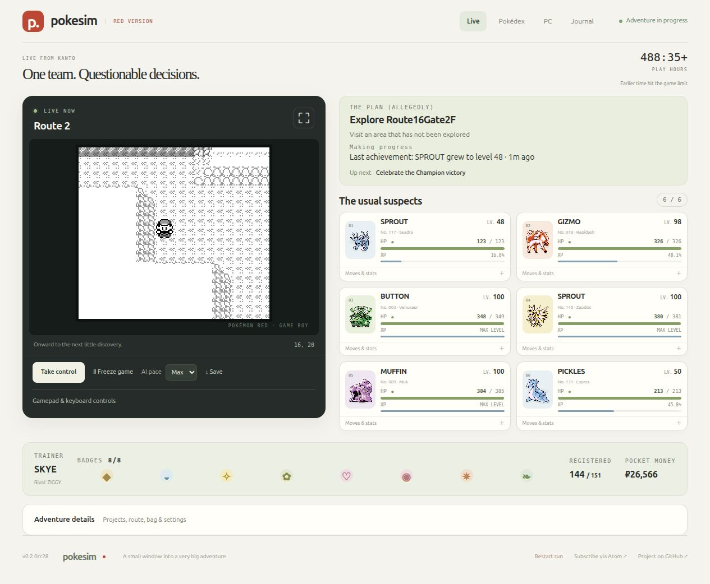
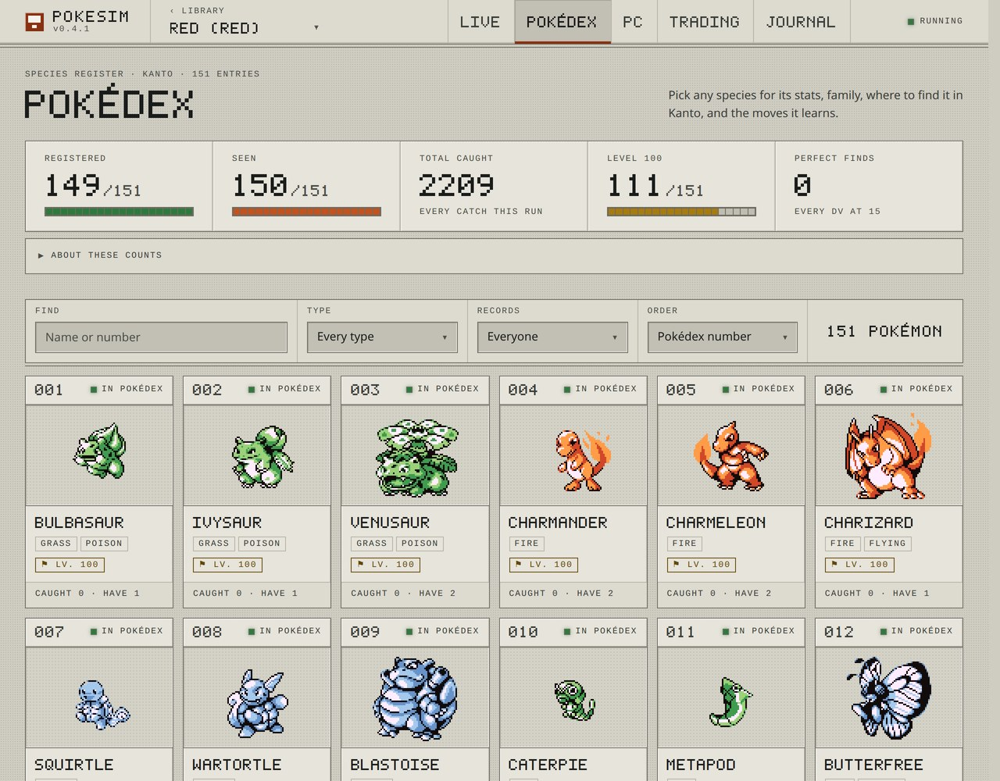
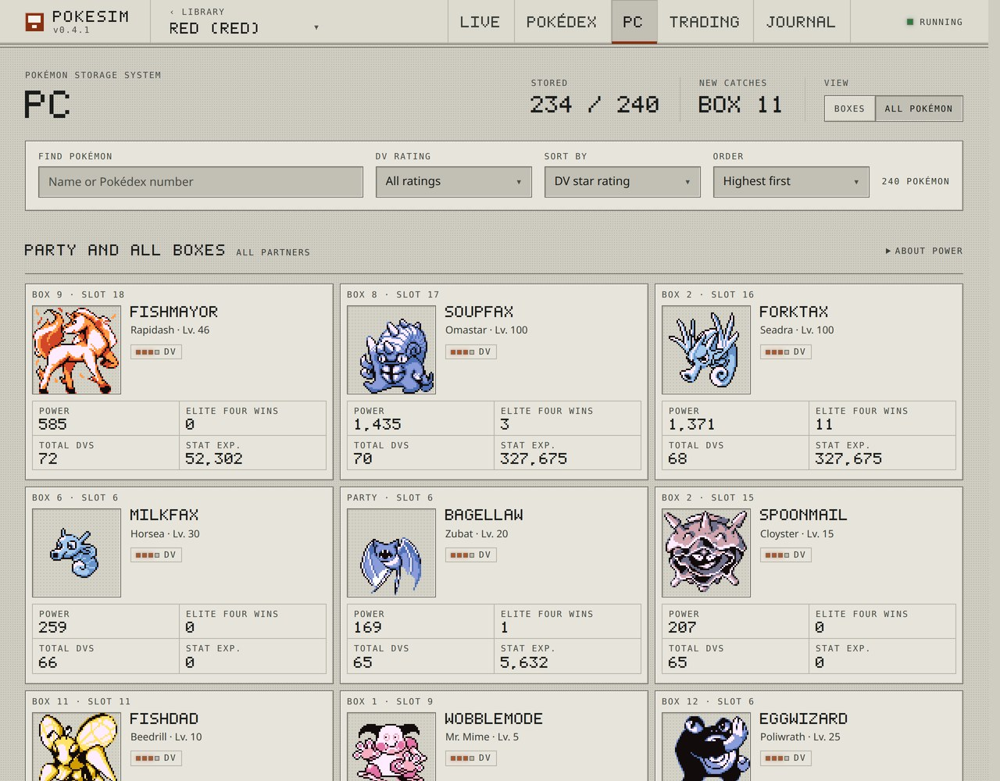

# PokeSim

### A Pokémon adventure that keeps going while you're away.

PokeSim plays Pokémon Red and Blue by itself, and you watch it happen in your browser. Leave it running and come back to a new catch, an evolution, or a badge you didn't see it earn. Take the controls whenever you want, then hand the game back.

Fair warning: you will get attached to a Lapras named PICKLES, and you will argue with its battle decisions.



*The live adventure: the game, the team, and the plan (allegedly), all in one place.*

## What you get

Battles, catches, evolutions and the slow march to the Pokémon League, with the current plan spelled out along the foot of the page: what it is doing, how that is going, and what comes next. Your six travelling companions sit beside the game with their moves, remaining PP and DV rating on the card, no clicking required. Keyboard and touch controls are there when you want to steer, and a speed dial from 0.5× up to Max when you want to skip ahead or slow down and actually watch a fight.

There's a Journal of milestones with screenshots — including, when two adventures meet in the Cable Club, which Pokémon crossed and who sent it — and you can follow it in a feed reader or as phone notifications through [ntfy](https://ntfy.sh). Open the Library, choose **Notifications**, generate a topic and subscribe to it in the ntfy app. There is no account and nothing to edit. After the Hall of Fame it keeps going, working on collection, training and evolution projects.

It decides everything locally with ordinary game logic. No model API key, no subscription, no per-move bill.

## The collection is half the fun

Browse all 151 Kanto entries, search by name or type, and see who's registered, who's only been spotted, and who's still out there somewhere.



*One more entry. One more reason to check back.*

The PC searches your party and every box at once, sorts by DV rating, and shows each partner's stats and training. Four stars means perfect DVs.

<details>
<summary><strong>Look inside the PC</strong></summary>



*Two hundred and forty-one partners across the party and every box, sorted by DV rating. Yes, one of them is called TOADDEBT.*

</details>

You can run several adventures at once, Red and Blue side by side, each with its own saves. Eligible games trade with each other through the actual Cable Club, so trade evolutions work the way they always did. The [desktop and trading guide](docs/desktop.md) covers that.

## Bring your own ROM

PokeSim ships no ROMs and downloads none. You supply your own clean copy of Pokémon Red or Blue (USA, Europe), legally acquired, as I'm sure it is, like everyone else's. We're all upstanding citizens here and nobody is going to ask any follow-up questions. Your ROM never leaves your computer.

## Running it

On your own computer, with [pipx](https://pipx.pypa.io/stable/installation/) and Git:

```sh
pipx install git+https://github.com/afk-sapien/PokeSim.git
pokesim-desktop
```

Your browser opens the Library, where you add your ROM and start an adventure. Python 3.11 or newer, tested on 3.12. Without pipx, `python -m pip install git+https://github.com/afk-sapien/PokeSim.git` in a virtual environment does the same thing. `pipx upgrade pokesim` updates it later. The [desktop guide](docs/desktop.md) has released wheels, pinned versions, data locations and troubleshooting.

On a server, with Docker:

```sh
curl -fLO https://github.com/afk-sapien/PokeSim/releases/latest/download/compose.yaml
mkdir -p pokesim-app
sudo chown 10001:10001 pokesim-app
docker compose up -d
```

That pulls the published image, so there's nothing to build and no registry login. Open [localhost:8930](http://localhost:8930) and create your first adventure.

To change the port, the data folder or the address you browse to, put the settings in a `.env` file
next to `compose.yaml`. [env.example](https://github.com/afk-sapien/PokeSim/releases/latest/download/env.example)
from the same release lists them all. It's optional, and settings kept there survive replacing
`compose.yaml` on your next upgrade.

<details>
<summary>Rather write the Compose file yourself?</summary>

This is the short version of what the release downloads. Save it as `compose.yaml`, create the
`pokesim-app` folder as above, and run `docker compose up -d`:

```yaml
services:
  pokesim:
    image: ghcr.io/afk-sapien/pokesim:0.3.0
    container_name: pokesim
    ports:
      - "127.0.0.1:8930:8000"
    environment:
      PUBLIC_URL: http://localhost:8930
    volumes:
      - ./pokesim-app:/data
    restart: unless-stopped
    init: true
    read_only: true
    cap_drop: [ALL]
    security_opt: [no-new-privileges:true]
    tmpfs:
      - /tmp:size=256m,mode=1777
    stop_grace_period: 90s
```

The data folder must be writable by user 10001, which is what the `chown` above does. Change
`PUBLIC_URL` to the address you'll open in your browser, and keep the published port matching it.

</details>

See [self-hosting](docs/self-hosting.md) for upgrades, offline image archives and building from source.

Either way, the games keep running when you close the tab, and your computer has to stay awake for them to get anywhere. Use **Save and quit** to stop everything cleanly.

**One thing worth knowing about access:** there's no login. Anyone who can reach the Library can manage it, so both the desktop launch and the default Docker port stay on localhost. If you want it reachable from elsewhere, put it behind an authenticated HTTPS proxy or keep it on a private network, and set `PUBLIC_URL` to the address you'll actually use.

**Upgrading from the old single-game version?** Stop and back up each adventure first, then import it into a fresh application folder. The original launcher still exists as `pokesim legacy`. Don't point the old trading coordinator and the new manager at the same games.

## This is still a beta

Runs have reached the Hall of Fame, but the automatic player still gets stuck sometimes. A full campaign, all 151 registrations, and weeks of uninterrupted progress aren't guaranteed. [Current progress and known limits](RELEASE_STATUS.md) is the honest version.

Found a strange decision, or have an idea that would make it more fun? [Open an issue](https://github.com/afk-sapien/PokeSim/issues) or say hello in [Discussions](https://github.com/afk-sapien/PokeSim/discussions).

- [Gameplay and feature guide](docs/guide.md)
- [Backups, updates, and troubleshooting](docs/operations.md)
- [Development and bug-reporting guide](CONTRIBUTING.md)
- [Security and private reporting](SECURITY.md)
- [Code of conduct](CODE_OF_CONDUCT.md)
- [Getting help](SUPPORT.md)

## Odds and ends

PokeSim is an unofficial fan project with no connection to Pokémon's rights holders. The code is [MIT licensed](LICENSE). ROMs, portrait packs and generated game data are yours and aren't distributed here.

The screenshots use a portrait pack that isn't included. To use your own, drop `1.png` through `151.png` into the application's `assets/sprites` folder and every adventure will pick them up. Without them you get a neutral placeholder.

AI coding assistance was used while building and testing this. The automatic player itself is plain local rules, not a model. See [third-party notices](THIRD_PARTY_NOTICES.md) and [dependency licensing](docs/licensing.md).
