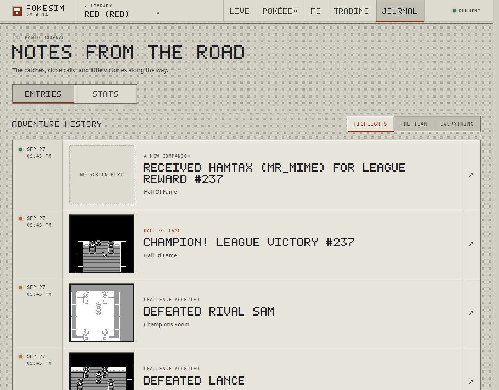
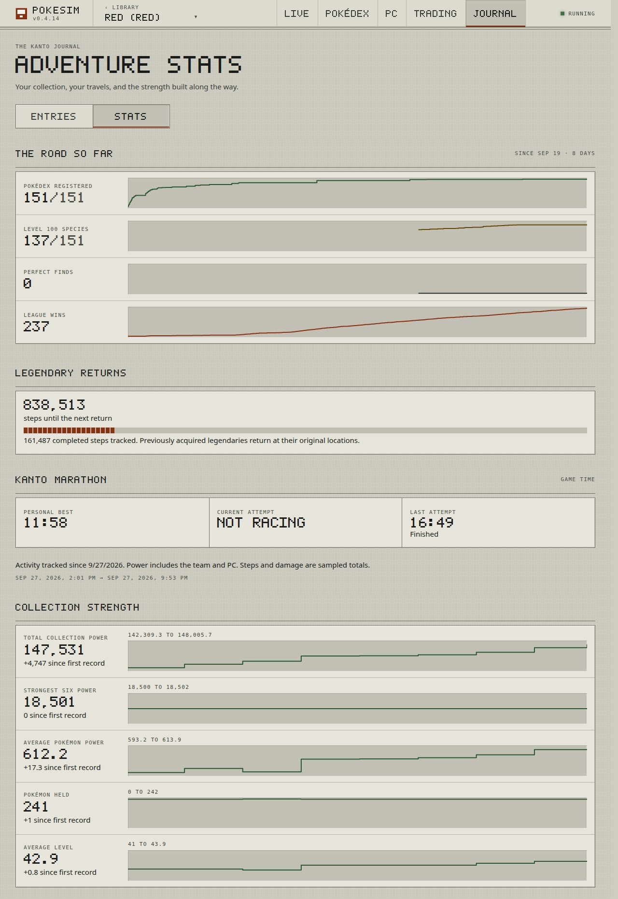
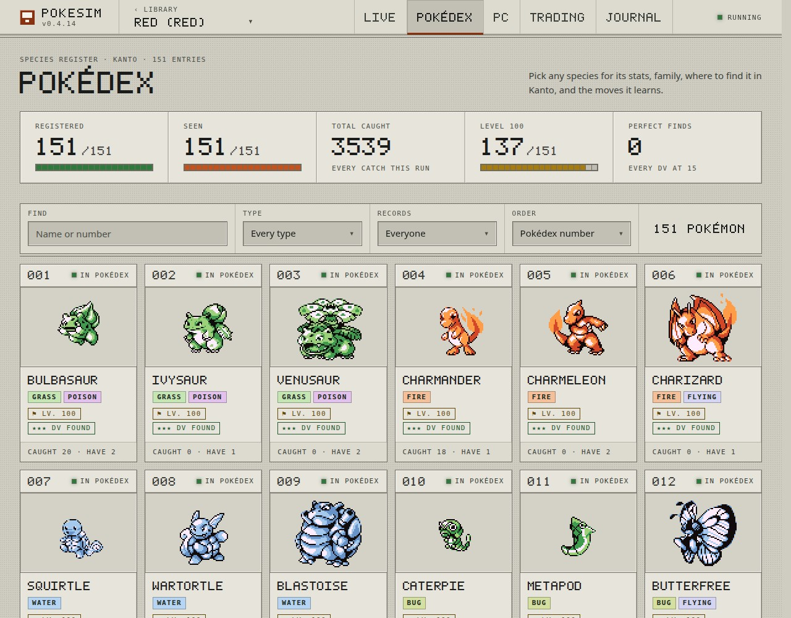
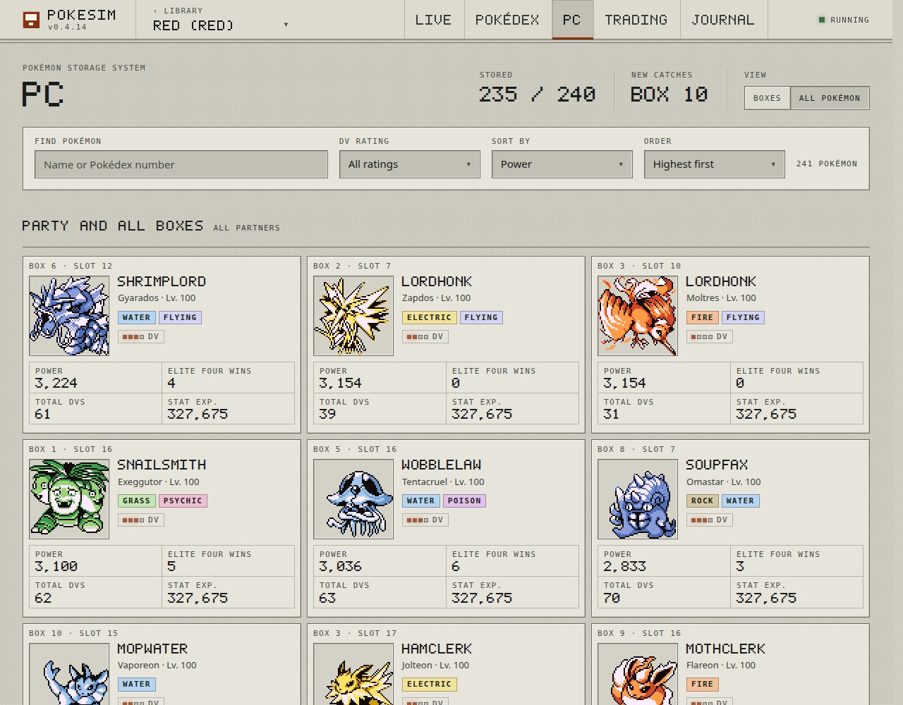

# PokeSim

### A Pokémon adventure that keeps going while you're away.

PokeSim plays Pokémon Red and Blue by itself, and you watch it happen in your browser. Leave it running and come back to a new catch, an evolution, or a badge you didn't see it earn. Take the controls whenever you want, then hand the game back.

Fair warning: you will get attached to a Lapras named WOBBLECOP, and you will argue with its battle decisions.


*FISHCRIME used STOMP. The rest of the team is waiting for its turn.*

## What you get

Battles, catches, evolutions and the slow march to the Pokémon League, with the current plan spelled out along the foot of the page: what it is doing, how that is going, and what comes next. Your six travelling companions sit beside the game with their health, experience and DV rating on the card, and one tap opens a partner's moves, remaining PP and battle stats. Keyboard and touch controls are there when you want to steer, and a speed dial from 0.5× up to Max when you want to skip ahead or slow down and actually watch a fight.

The Journal has separate Entries and Stats pages. Entries records milestones with screenshots, including Pokémon exchanged in the Cable Club. Stats charts collection power, DV quality, catches, travel, battles, and marathon finishes alongside Pokédex and League progress. It also shows your marathon personal best and progress toward the next legendary return. See the [adventure statistics guide](docs/adventure-statistics.md) for counting rules and long-term history. Journal entries are also available through a feed reader or phone notifications with [ntfy](https://ntfy.sh).



*It keeps its own notes, so you can catch up on what you missed.*

<details>
<summary><strong>See the adventure stats</strong></summary>



*An entire Pokédex, a faster marathon, and a stronger collection. There is always another number to improve.*

</details>

Open the Library, choose **Notifications**, generate a topic and subscribe to it in the ntfy app. There is no account and nothing to edit. After the Hall of Fame it keeps going, working on collection, training and evolution projects.

It decides everything locally with ordinary game logic. No model API key, no subscription, no per-move bill.

## The collection is half the fun

Browse all 151 Kanto entries, search by name or type, and see who's registered, who's only been spotted, and who's still out there somewhere. Fill it and the counts keep going: how many have reached level 100, and how many turned out to be perfect.



*All 151 registered, 137 species at level 100, and still looking for that perfect catch.*

The PC searches your party and every box at once. All Pokémon starts with the strongest partners first, with other sort options and DV filters when you want to find a promising trainee. Four stars means perfect DVs.



*Your strongest partners up front, with the next promising trainee waiting somewhere in the boxes.*

You can run several adventures at once, Red and Blue side by side, each with its own saves. Eligible games trade with each other through the actual Cable Club, so trade evolutions work the way they always did. The [desktop and trading guide](docs/desktop.md) covers that.

## Bring your own ROM

PokeSim ships no ROMs and downloads none. You supply your own clean copy of Pokémon Red or Blue (USA, Europe), legally acquired, as I'm sure it is, like everyone else's. We're all upstanding citizens here and nobody is going to ask any follow-up questions. Your ROM never leaves your computer.

## Running it

On your own computer, paste the command for your system into a terminal. The installer
sets up uv, Python 3.12, and the released PokeSim package for your user account.
You do not need to install Python, pipx, Git, or Docker first. Internet access is required.

**macOS or Linux:**

```sh
curl -fsSL https://github.com/afk-sapien/PokeSim/releases/latest/download/install.sh | sh
```

**Windows PowerShell:**

```powershell
powershell -NoProfile -ExecutionPolicy Bypass -Command "irm https://github.com/afk-sapien/PokeSim/releases/latest/download/install.ps1 | iex"
```

Run the launch command printed at the end. Your browser opens the Library, where you add
your ROM and start an adventure. Run as your normal user, without sudo or an administrator
terminal. The [desktop guide](docs/desktop.md) explains what the scripts download, how to
review them first, manual installation, updates, and troubleshooting.

**On a server or with Docker Desktop:** use Linux containers on an x86-64 computer.
Create a new folder for this installation, download the quick-start file as `compose.yaml`,
then start it:

```sh
mkdir pokesim
cd pokesim
curl -fL --retry 3 -o compose.yaml https://github.com/afk-sapien/PokeSim/releases/latest/download/compose.quickstart.yaml
docker compose up -d --wait
```

In Windows PowerShell, use `curl.exe` for the download command. Open
[localhost:8930](http://localhost:8930) and create your first adventure. Docker manages a
persistent volume, so there is no data-folder creation or ownership command. Keep this
installation folder in the same location and use it for future Compose commands.

For updates, save a backup from **Settings and backups**, then follow
[self-hosting](docs/self-hosting.md). That guide also covers remote access, custom ports,
source builds, and existing bind-mount installations. **Existing Docker users:** keep your
current Compose file and data mount. The quick-start file is for new libraries.

Either way, the games keep running when you close the tab, and your computer has to stay awake for them to get anywhere. Use **Save and quit** to stop everything cleanly. A busy adventure no longer eats disk while it does: finished trades keep only their newest twenty, and the database gives back empty space each time it starts.

**One thing worth knowing about access:** there's no login. Anyone who can reach the Library can manage it, so both the desktop launch and the default Docker port stay on localhost. If you want it reachable from elsewhere, put it behind an authenticated HTTPS proxy or keep it on a private network, and set `PUBLIC_URL` to the address you'll actually use.

**Upgrading from the old single-game version?** Stop and back up each adventure first, then import it into a fresh application folder. The original launcher still exists as `pokesim legacy`. Don't point the old trading coordinator and the new manager at the same games.

## This is still a beta

Runs have reached the Hall of Fame, but the automatic player still gets stuck sometimes. A full campaign, all 151 registrations, and weeks of uninterrupted progress aren't guaranteed. [Current progress and known limits](RELEASE_STATUS.md) is the honest version.

Found a strange decision, or have an idea that would make it more fun? [Open an issue](https://github.com/afk-sapien/PokeSim/issues) or say hello in [Discussions](https://github.com/afk-sapien/PokeSim/discussions).

- [Gameplay and feature guide](docs/guide.md)
- [Backups, updates, and troubleshooting](docs/operations.md)
- [Development and bug-reporting guide](CONTRIBUTING.md)
- [Security and private reporting](SECURITY.md)
- [Code of conduct](CODE_OF_CONDUCT.md)
- [Getting help](SUPPORT.md)

## Odds and ends

PokeSim is an unofficial fan project with no connection to Pokémon's rights holders. The code is [MIT licensed](LICENSE). ROMs, portrait packs and generated game data are yours and aren't distributed here.

Portraits come out of your own cartridge. When you add a ROM, PokeSim decodes all 151 front
sprites from it and keeps them in the application's `assets/sprites` folder, so the Pokédex
and the PC are illustrated without you finding artwork anywhere. Nothing is shipped and nothing
is fetched for this. Drop your own `1.png` through `151.png` in that folder to override any of
them. A file that is already there is never replaced.

AI coding assistance was used while building and testing this. The automatic player itself is plain local rules, not a model. See [third-party notices](THIRD_PARTY_NOTICES.md) and [dependency licensing](docs/licensing.md).
