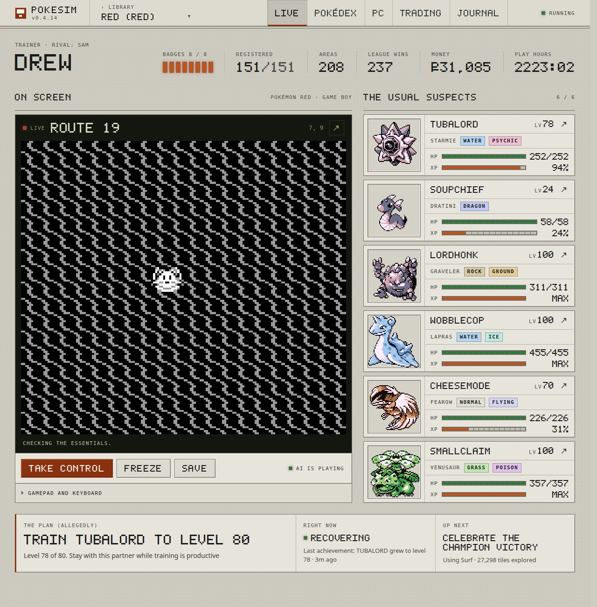
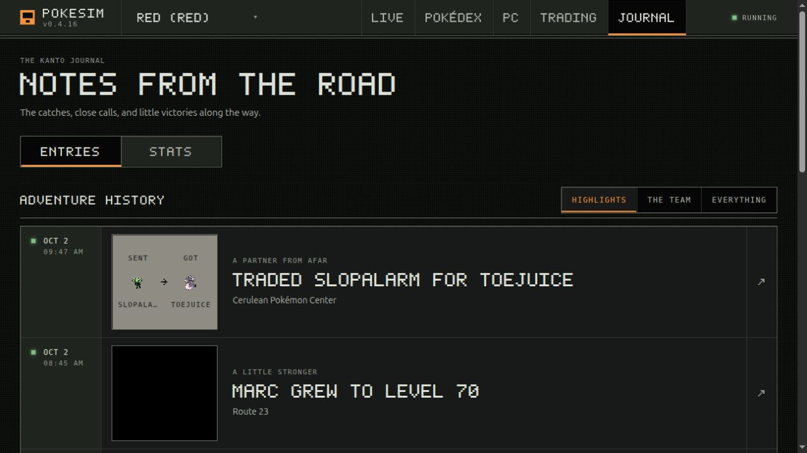
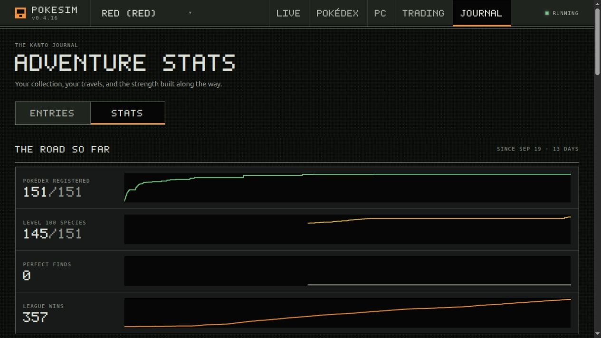
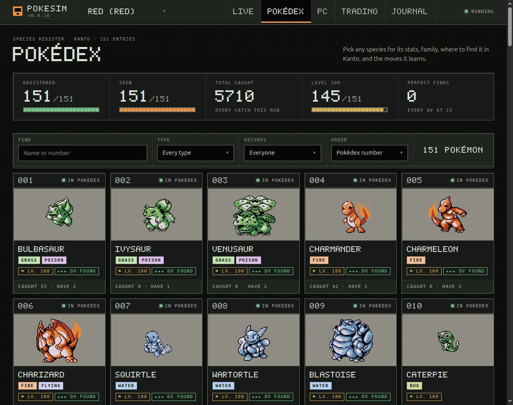
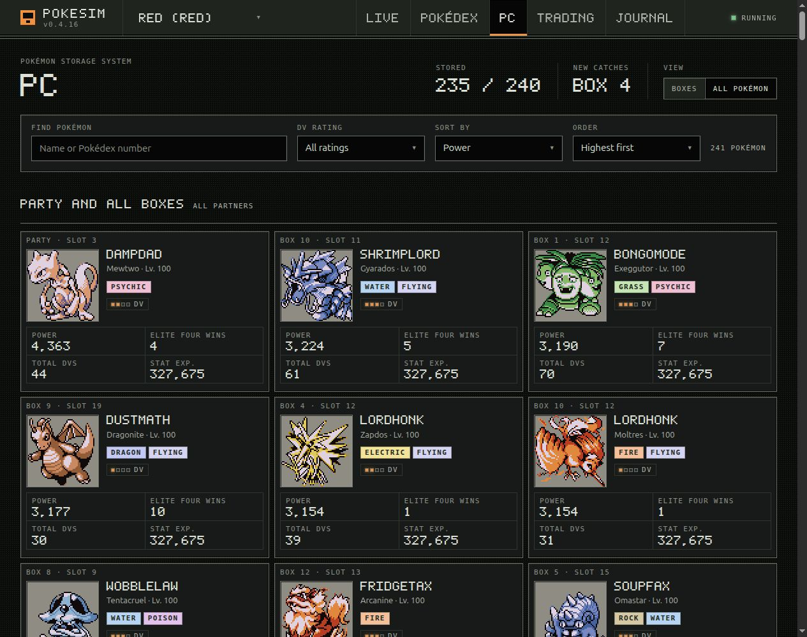
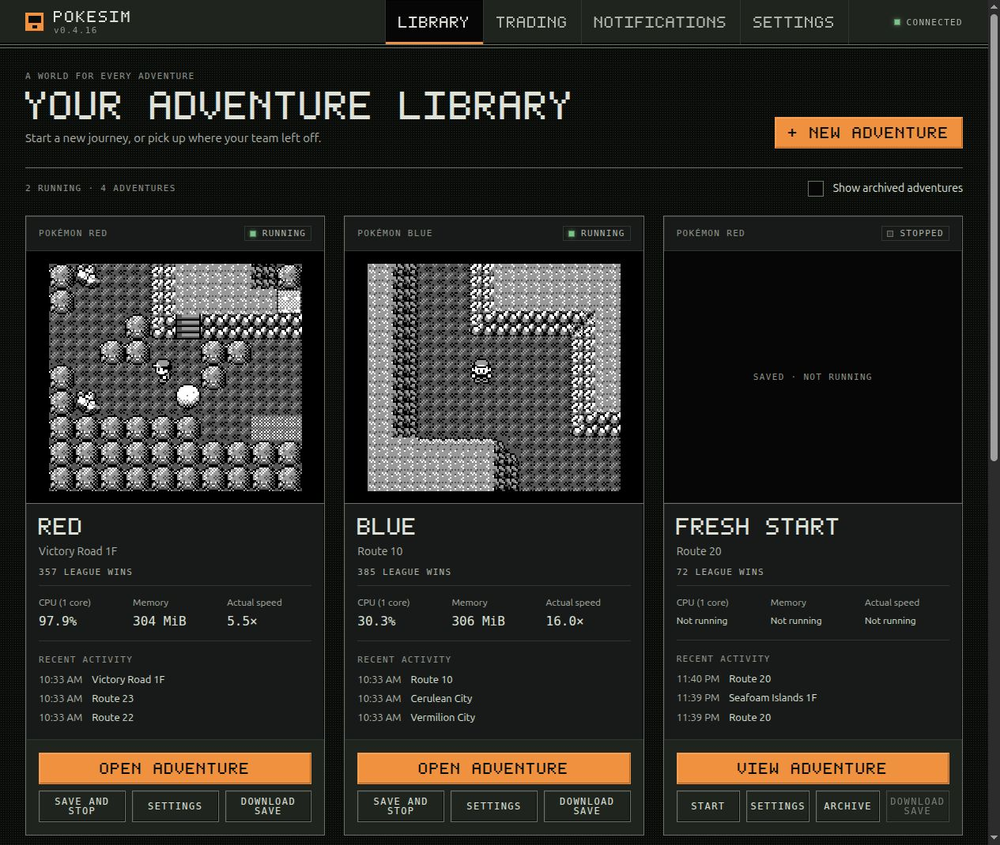

# PokeSim

**Pokémon Red, Blue, Gold, Silver and Crystal adventures that keep going while you're away.**

Watch an automatic player catch Pokémon, earn badges and challenge the League in
your browser. Take control whenever you like, then hand the adventure back.
Everything runs locally, with no model API or subscription.



## Keep the adventure going

- **Independent games:** Run adventures from both generations side by side, each with its own saves
  and speed. Check CPU, memory and observed speed in the Library.
- **A growing collection:** Explore the Pokédex and search every PC box. Compare
  power, types and DV quality to find promising Pokémon.
- **They trade with each other:** Adventures automatically meet in the in-game
  Cable Club and exchange Pokémon over a virtual link cable, including trade evolutions.
- **Milestones and stats:** Follow catches, League wins, collection strength and
  marathon personal bests in the Journal.
- **Life after the League:** Keep training, rotate League teammates, revisit
  eligible encounters and earn new Pokémon.
- **Your own touch:** Add nickname prefixes and suffixes, take over the controls,
  or export a standard `.sav` to continue in another emulator.

| Journal entries | Adventure stats |
| --- | --- |
| [](docs/images/journal-panel.jpg) | [](docs/images/stats-panel.jpg) |

Gold, Silver and Crystal include autonomous journeys through all 16 badges and
Red, the 251-species Pokédex, breeding, held items and Gen II Cable Club trades.
See [Generation II support and validation](docs/gen2-exploration.md) for cartridge
revisions, test evidence and compatibility boundaries. This support is on the
development branch and is not included in the public v0.4.17 downloads below.

## The collection is half the fun

In Red and Blue, want all 151? Run both games and let them trade version exclusives and
trade evolutions automatically. New adventures created in the Library have
these rewards and return visits **enabled by default**, so the collection keeps
growing beyond the original games' one-time encounters:

- **Another Eevee, another fossil:** After becoming Champion and unlocking the
  original events, revisit gifts, fossils, the Fighting Dojo and supported NPC
  trades after **100,000 steps** by default.
- **Legendary rematches:** Previously acquired legendary birds and Mewtwo can
  return to be caught again every **1,000,000 steps** by default.
- **A mythical reward:** A custom Mew gift arrives in the PC after your first
  League win. Mew isn't normally obtainable in either game. Another
  million steps followed by a new League win earns another.
- **More starters:** Receive a random Bulbasaur, Charmander or
  Squirtle after each new League win.

Change or disable these rewards in each adventure's settings.
[How return visits work](docs/step-rewards.md).

| Pokédex | PC collection |
| --- | --- |
| [](docs/images/pokedex-panel.jpg) | [](docs/images/pc-panel.jpg) |

## A few extras for the long run

- **Meet WAFFLEKING:** 6,117 built-in nicknames, plus your own prefixes
  and suffixes. Every collection deserves a few questionable names.
- **Milestones in your pocket:** Catch updates and adventure screenshots through
  ntfy, Discord or Telegram.
- **The Kanto Marathon:** Sometimes the next big goal is a run around Kanto.
  Follow the race and see whether your trainer beats their personal best.

The expanded name pool and Discord and Telegram support are coming in
[0.4.17](docs/release-notes.md). Follow the [changelog](CHANGELOG.md) for new additions.

## Your adventure library

Manage games in one place, with live screens, recent activity, CPU and memory
usage, and the speed each simulation is actually reaching.



## Install

Bring your own supported Pokémon Red, Blue, Gold, Silver or Crystal ROM that you are
entitled to use. Supported builds are English USA/Europe, with Crystal Rev 1.
Professor Oak supplies starters, not ROMs. PokeSim does not
include or download ROMs. Your ROM stays on the machine running PokeSim.

### Server: Docker Compose

On an x86-64 machine with Docker Compose, create a new installation folder:

```sh
mkdir pokesim
cd pokesim
curl -fL --retry 3 -o compose.yaml https://github.com/afk-sapien/PokeSim/releases/latest/download/compose.quickstart.yaml
docker compose up -d --wait
```

Open [localhost:8930](http://localhost:8930), add your ROM and create an adventure.
On Windows PowerShell, use `curl.exe`. Docker keeps your library in a persistent
volume. Keep this folder for future Compose commands.

**Already installed?** Keep your existing Compose file and data mount. Back up
before upgrading. The [self-hosting guide](docs/self-hosting.md) covers updates,
remote access and custom ports.

### Desktop: install with uv

Install [uv](https://docs.astral.sh/uv/getting-started/installation/) using your
package manager:

| Platform | Command |
| --- | --- |
| Windows with WinGet | `winget install --id astral-sh.uv --exact` |
| macOS with Homebrew | `brew install uv` |
| Linux with pipx | `pipx install uv`, then `pipx ensurepath` |

Open a new terminal, then install the current public release:

```sh
uv tool install --python 3.12 --managed-python https://github.com/afk-sapien/PokeSim/releases/download/v0.4.17/pokesim-0.4.17-py3-none-any.whl
uv tool update-shell
```

Open another terminal and run `pokesim-desktop`. It opens the Library in your
browser. uv manages Python for you. See the [desktop guide](docs/desktop.md) for
package-manager prerequisites, updates and removal.

Games continue after you close the browser tab. Keep the host awake and use
**Save and quit** to stop cleanly. The Library has no login, so anyone who can
reach it can manage it. Default installations bind to localhost. Use a private
network or an authenticated HTTPS proxy for remote access.

## Help and documentation

PokeSim is an experimental beta. Adventures can reach the Hall of Fame, but the
automatic player can still get stuck. See [release status and known limits](RELEASE_STATUS.md).

- [Gameplay and notifications](docs/guide.md)
- [Statistics and counting rules](docs/adventure-statistics.md)
- [Backups and troubleshooting](docs/operations.md)
- [Report a bug or request a feature](https://github.com/afk-sapien/PokeSim/issues)
- [Discussions](https://github.com/afk-sapien/PokeSim/discussions) and [contributing](CONTRIBUTING.md)
- [Security](SECURITY.md) and [community guidelines](CODE_OF_CONDUCT.md)

PokeSim is an unofficial fan project, unaffiliated with Pokémon's rights holders.
Code is [MIT licensed](LICENSE). ROMs and generated game data are not distributed.
AI coding assistance was used during development. The automatic player uses local
rules. See [third-party notices](THIRD_PARTY_NOTICES.md) and [dependency licenses](docs/licensing.md).
