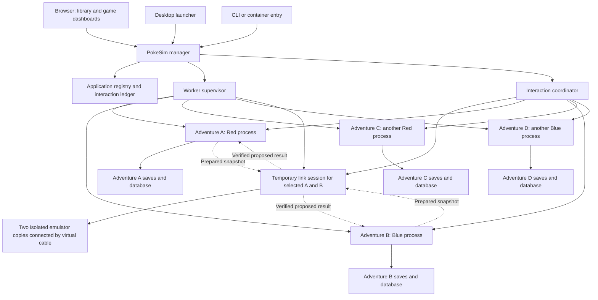

# One PokeSim app, multiple adventures

Architecture and implementation plan. Prepared September 15, 2026 against the working tree reporting v0.2.0rc30.

**Status: proposed design, not implemented behavior.** Revised September 15, 2026 to make the proven Cable Club experiment the required trading pathway. This plan covers the application refactor. It does not authorize migrating or restarting existing deployed games as part of writing the plan.

## 1. Recommendation

Build one PokeSim application that creates, runs, displays, and connects multiple adventures. Ship that application as both a desktop download and one Docker container. Give it one browser address and one persistent application data folder.

Internally, use one manager process and one child process per running adventure. The manager contains the application API, process supervisor, library, and interaction coordinator. Each adventure child contains the existing emulator, its policies, its storage, and a private game API. During a trade, launch one temporary link-session child containing two PyBoy instances on isolated copies of the reserved adventures. Their cartridges execute the Cable Club trade. The ordinary adventure workers remain held until both results are durably accepted or the operation is aborted.

This is a good fit for the product. Users should manage adventures through PokeSim rather than managing separate containers, ports, and configuration files. Separate child processes preserve useful failure isolation and allow games to use different CPU cores. They do not constitute a security sandbox or provide independent memory quotas inside the container.

The manager is a shared point of failure. Make it small, keep emulation and expensive game work out of it, and make its state recoverable. A manager restart will interrupt its children, then recover and restart eligible adventures. Do not promise uninterrupted games during a manager crash or application upgrade.

Docker supports a service with multiple worker processes. The container's main process must manage the children it starts. An init process can help with signal handling and child reaping. This makes one container appropriate for this tightly related application. [Docker process guidance](https://docs.docker.com/engine/containers/multi-service_container/)

### Core decisions

| Decision | Recommendation |
| --- | --- |
| User-facing product | One application, one library, one address |
| Execution | One manager, one process per running adventure, and a temporary paired link-session process during a trade |
| Trading mechanism | Original Cable Club gameplay through the proven ROM-hook transport. No direct Pokémon record swap or fallback |
| Desktop versus Docker | Different entry adapters around the same manager |
| Storage | One manager database and one database per adventure |
| External dependencies | Keep Python, FastAPI, SQLite, and PyBoy. No Redis, external database, or message broker required |
| Interaction ownership | Coordinator records the decision. Each participant owns its local state changes |
| First supported topology | Several adventures in one installation, including several of the same version |
| Initial concurrency | Several games running, one coordinated interaction at a time |
| Compatibility | Preserve current saves and gameplay behavior during extraction |
| Later expansion | Remote management can reuse participant contracts. Remote cable execution needs a separate transport and trust design |

## 2. Scope and assumptions

The first release serves one owner, or a trusted household using that owner's application. It is not a public hosting service for mutually untrusted customers.

Required outcomes:

- Create, name, start, stop, archive, inspect, and resume multiple adventures in one UI.
- Keep current live controls, PC, Pokédex, journal, notifications, and save protections.
- Start the same manager from a desktop launcher, Python CLI, or container.
- Configure useful automatic trades among selected local adventures through the UI.
- Execute exchanges through the original Cable Club menus, party exchange, evolution, Pokédex, and saving routines using the experimental virtual connection.
- Harden that connection and integrate normal gameplay preparation, safe exit, cancellation, and durable recovery before enabling managed trading.
- Preserve individual Pokémon protection and the existing transaction recovery guarantees.
- Import existing desktop and server adventures through a controlled migration flow.
- Explain waiting, stopped, failed, and recovery states clearly.
- Test the packaged process model on Windows, Intel Mac, Apple Silicon, and Linux x86-64 and ARM64.

Designed for later, not implemented in this refactor:

- Connections between installations on different computers.
- Accounts, invitations, and permissions for unrelated owners.
- Link battles, general shared real-time play, and hardware-cycle-accurate cable emulation. Cable Club trading is required in this refactor.
- Other generations or arbitrary ROM hacks.
- Automatic operating-system startup, a tray application, and automatic updates.
- Multiple manager replicas, distributed consensus, and large-scale scheduling.

Signing and notarization are distribution work alongside this plan. They are required for a polished downloadable release, but they do not dictate the runtime architecture.

## 3. User experience

### Library

The home page becomes the adventure library. Each card shows a display name, game version, thumbnail, current activity, state, and last save. Actions are Open, Start, Stop, Settings, and Archive, with availability determined by state.

Examples:

```text
PokeSim
  Adventures
    Weekend Red       Running       Open / Stop
    Blue collection   Waiting       Open / View trade
    Another Red       Stopped       Start
  New adventure
  Trading
  Settings and backups
```

Creating an adventure consists of selecting a previously added ROM or supplying another, naming the adventure, choosing its starter and basic settings, and selecting Start. Prepare shared reference data once per required version. Show progress for setup and offer a retry when it fails.

The same ROM can support multiple independent adventures. Shared ROM storage does not share gameplay state.

### Individual adventure

Opening a card leads to that adventure's existing dashboard. Keep an obvious adventure switcher and a Library link on Live, PC, Pokédex, Journal, and Trading pages. A game name is a label, not a URL identifier.

Make these different actions explicit:

- Pause game: keep its process alive and allow inspection.
- Stop adventure: save and stop that one process.
- Quit PokeSim: save and stop all running adventures, then close the manager.
- New run: an intentional gameplay reset with separate confirmation and a new campaign identity.
- Archive adventure: hide an inactive adventure without deleting its files.

Keep browser closure independent from process shutdown. A stopped adventure should still have a useful page showing its last known summary, stopped status, and Start button. Full offline journal browsing can follow if it would require extra database readers in the first release.

### Trading

Add an application-wide Trading page for group membership, global status, proposed exchanges, and history. Individual game pages show the same information from that adventure's perspective.

The owner selects participating adventures and enables automatic trading. Existing per-Pokémon locks, withdrawals, party protection, and project protection remain in force. An interaction involving A and B must not pause C. A stopped game is excluded, and a held game says which interaction it is waiting for.

During a trade, show both participating games and progress through Preparing, Connecting, Trading, Saving, and Resuming. Route their live views to the matching side of the temporary link session, with a visible provisional status until commitment. Keep adventure IDs and browser addresses stable. Disable ordinary gameplay controls while reserved and make cancellation availability depend on the durable decision.

Show the meaningful reason for no trade, such as no useful exchange, partner stopped, waiting for safe gameplay, incompatible data, or recovery required. Do not present every lack of progress as a network error.

## 4. What the current code gives us

| Existing area | Reuse | Change |
| --- | --- | --- |
| `emulator.py` | PyBoy lifecycle, command queue, policies, checkpoint restoration | Inject settings and data, extract lifecycle ownership, expose worker operations |
| `__main__.py` and `desktop.py` | Server and desktop entry behavior | Replace duplicated runtime management with thin manager adapters |
| `config.py` | Existing settings and validation rules | Parse explicit validated objects, avoid mutable globals |
| `game_data.py`, `strategy_data.py`, `ram.py`, policy constants | Generated data verification and interpretation | Remove import-time dependence on a particular adventure's directory |
| `store.py` and `checkpoints.py` | Local database, atomic file publication, fallback checks | Common runtime lock, transaction staging rules, explicit restore provenance |
| `web/app.py` and static pages | The current dashboard and game controls | Instance-scoped routes and injected capabilities |
| `broker/inventory.py` and `broker/routine.py` | Read models and pure trade selection | Accept an arbitrary participant set from the registry |
| `trade/service.py` | Durable holds, recovery ordering, scheduling behavior | Remove exact Red/Blue peer set and direct participant database writes |
| `trade/pair.py` and `trade/execute.py` | Inventory conservation checks, provenance, and recovery requirements | Replace direct record mutation and manual evolution with cartridge-driven Cable Club execution |
| Cable experiment at commit `705ec4d`, `tools/cable_club_spike.py` | Proven connection hooks, paired stepping, and cartridge-result checks | Extract a production transport, gameplay driver, isolated session worker, and bounded failure handling |
| `trade/event.py` and `rewards.py` | Existing reward eligibility and duplicate prevention | Make single-adventure events independent of unrelated peers |
| `desktop_setup.py` and build tools | ROM checks, verified setup, packaging | Shared assets and import workflows, bundled worker launch |

Specific constraints found in the current implementation:

- The desktop launcher mutates `config` and `os.environ` before importing runtime modules.
- `strategy_data.py` loads its active bundle at module import. Several other modules derive constants from it at import.
- Desktop and server each construct and shut down the emulator themselves.
- Only the desktop entry point currently takes the desktop process lock.
- Browser requests and links assume one root-level game, including `/api/control`, `/frame.jpg`, `/shots`, and `/events`.
- The coordinator asserts that peer names are exactly `red` and `blue`.
- The paired worker reads fixed `/pair` and `/roms` locations and opens participant SQLite files.
- The container health check describes a single emulator service, not a library where zero running games is valid.

The historical `multi-game.md` describes older separate-container and trading ideas. Preserve it as history and link to this plan when implementing the replacement. Do not use its older release assumptions as the current transaction specification.

### Cable Club implementation baseline

The relevant work is branch `codex/cable-club-experiment`, commit `705ec4ddc2f0e5a1265170b33f101141c5892960`, currently checked out at `/tmp/pokesim-cable-club`. Its report is `docs/cable-club-experiment.md`, recorded evidence is `docs/validation/cable-club-20260915.json`, and its two tools are `tools/cable_club_spike.py` and `tools/prepare_cable_fixtures.py`. These files currently belong to that branch. Preserve the source revision and bring the report and tests into the implementation changes. Do not make an installed app depend on a temporary worktree path.

Code and recorded evidence inspected for this plan establish:

- English Red and Blue on PyBoy 2.7.0 complete one actual in-game trade between synthetic test parties. Normal and reversed connection roles pass.
- Haunter and Kadabra evolve through the games' own code. Stable individual fields, untraded party members, and Pokédex results are checked.
- Hook-free checkpoint reload and cold cartridge-save restart preserve the resulting parties.
- Disabling the virtual connection prevents the trade and leaves the parties unchanged.
- The exchange harness supplies connection roles and byte/nybble messages. It does not copy Pokémon records or apply evolutions. Synthetic party construction belongs only to the fixture generator.

This is recorded experimental evidence, not a fresh reproduction performed while editing this plan. The earlier `docs/link-spike.md` describes a narrower transport spike and is not the extent of the current work.

The implementation replaces synchronous serial routines through ROM hooks and temporarily parks a waiting CPU. It is a virtual connection for authentic cartridge gameplay, without hardware-cycle-accurate serial emulation. Currently it assumes verified English ROMs, two emulators in one process, a particular Center, the first party slot, and one trade. Export happens at the next trade-selection screen. Navigating out of the Club and resuming autonomous play is not yet proved. There is no durable production two-adventure commit or disconnect recovery.

## 5. Runtime architecture



The supervisor and coordinator are modules within the manager process initially. They are not additional services that users install. Each adventure worker runs one game API and the emulator's existing execution thread.

Adventure A and C can both be Red, and B and D can both be Blue. There is no singleton process per version. Any eligible pair can occupy the link session. Unselected adventures continue normally. The first release runs at most one link session at a time.

The manager must never tick a PyBoy instance, implement a gameplay policy, or edit a live participant database. Adventure workers must never reach into a sibling worker's filesystem. A link-session worker receives only transaction-scoped immutable snapshots, verified shared ROM/reference assets, and an isolated output directory. It cannot publish authoritative adventure state or write either adventure database.

Keeping both temporary emulators in one link process preserves the experimentally proven synchronous transport. It avoids making a new cross-process serial implementation a prerequisite. This is a bounded transaction executor, separate from the long-lived adventure runtime. Its two sides require explicitly selected ROMs, symbols, data, and independent cartridge-save streams. It must not reuse mutable global configuration between sides.

Suggested module ownership:

```text
pokesim/
  app/
    manager.py         Application lifecycle and dependency assembly
    registry.py        Library metadata, desired state, and migrations
    supervisor.py      Child launch, health, exit, and restart policy
    assets.py          ROM and generated reference catalog
    migration.py       Existing-adventure import and validation
    backup.py          Consistent application backup and restore
  runtime/
    settings.py        Validated immutable launch settings
    session.py         SimulationRuntime owning emulator and store
    worker.py          Explicit child-process entry point
    protocol.py        Typed command and result contracts
    transport.py       Private local worker client and authentication
  interactions/
    coordinator.py    Durable decisions and recovery
    repository.py     Transactions, participants, and retained decisions
    participants.py   Participant interface
    trading.py        Trade eligibility and scheduling
    link_worker.py    Temporary paired emulator process and output contract
    cable.py          Versioned connection hooks and bounded message exchange
    cable_driver.py   In-game preparation, trade selection, and exit states
    verification.py   Independent source/result validation
  web/
    manager.py         Public application routes and authorization
    game.py            Existing game routes behind worker interface
```

These are ownership boundaries, not a demand to move every file at once. Existing domain modules can retain their names until a move reduces dependencies. Avoid large renames mixed with behavior changes.

## 6. Settings, reference data, and compatibility

Define separate configuration objects:

- `AppSettings`: application root, bind address, public URL, access settings, resource limits, logging, and launch policy.
- `AdventureSettings`: adventure ID, campaign ID, data paths, ROM reference, starter, playback settings, policy settings, notifications, and trading preferences.
- `WorkerLaunch`: effective adventure settings, runtime generation, protocol version, and bootstrap credentials.

The manager builds a fresh settings object for each child. UI changes update persisted settings through validation. Runtime changes such as speed use acknowledged commands. ROM changes, incompatible bundle changes, and process-level settings require an explicit stopped-state operation.

Environment variables configure the application or the legacy adapter. They must not change the currently selected adventure inside the manager. Preserve old environment names in the legacy single-game command during migration.

Introduce a verified `GameDataBundle` object loaded explicitly by bundle ID. Keep immutable content-addressed copies on disk and cache them by full bundle identity. Start by removing import-time file reads from the manager's dependency graph, then migrate worker modules to injected reference objects. Temporary worker-only compatibility adapters are acceptable, with an explicit removal milestone. Do not claim multiple games in one interpreter are safe until those globals are removed.

Separate these version concepts:

1. Application release version.
2. Manager database schema.
3. Per-adventure database schema.
4. Checkpoint format and PyBoy version.
5. Game-data bundle schema and digest.
6. Worker protocol version.
7. Interaction plan and result-manifest version.
8. Cable adapter version, supported ROM digests, and verified hook signatures.

Package verified hook address metadata for each supported ROM digest. Users must not need RGBDS, a reference checkout, or symbol-file paths to trade. Record the symbol source revision and validate instruction signatures, register/stack assumptions, and unused parking bytes before attaching hooks. Reject an unknown combination with a clear unsupported-trading status.

Validate compatibility before launch and again before an interaction. Matching game titles alone is insufficient. A release number is not a substitute for a checkpoint compatibility check.

## 7. Identity and storage

Use generated opaque IDs for applications, adventures, campaigns, and interactions. Keep human-readable names separately and allow duplicates. A fresh campaign receives a new ID even when launched inside an existing adventure profile.

Recommended data layout:

```text
application-data/
  app.sqlite
  application.lock
  assets/
    roms/<sha256>/rom.gb
    reference/<bundle-id>/...
  adventures/<adventure-id>/
    adventure.json
    runtime.lock
    pokesim.sqlite
    states/
    shots/
    interactions/
    logs/
  interactions/<transaction-id>/
    recovery-manifest.json
    inputs/<adventure-id>/
    attempts/<attempt-id>/outputs/<adventure-id>/
  imports/
  backups/
  logs/
```

`app.sqlite` is authoritative for the library, desired run state, selected settings, and coordinator decisions. `adventure.json` is a recovery/export manifest, not a second independently editable source of truth. Worker-private interaction receipts belong with that adventure's database and recovery files. The shared interaction directory holds immutable input copies and provisional session outputs. Only the matching adventure worker imports its verified result into private durable staging. Each side has a separate cartridge-save stream and output location, even when both use the same shared ROM. Never let PyBoy implicitly write a save beside a shared ROM.

The manager owns its database. Each worker owns its adventure database. Use transactions and short write operations. Set `synchronous=FULL` explicitly for the registry and participant interaction ledgers, then verify the resulting durability on supported filesystems. Do not hold a SQLite transaction while waiting on a child or downloading a file.

WAL mode can help concurrent read access to the registry, but it is not mandatory just because the application has several processes. If adopted, use appropriate durability settings for committed interaction decisions and local persistent storage. SQLite WAL does not support participating processes on different machines through a network filesystem. [SQLite WAL documentation](https://sqlite.org/wal.html)

ROMs and reference bundles are immutable and shared by reference. Adventure saves, journals, and Pokémon ownership are never shared. Remove an asset only when no adventure, retained backup, import job, or unresolved transaction references it.

Keep both the existing recognized ROM SHA-1 values and a catalog SHA-256 digest during transition. Centralize ROM identification so desktop and server use one policy. A deliberate legacy option for unverified ROMs must not silently make them eligible for coordinated trades.

### Locking and ownership

- One manager may own an application root at a time.
- One worker may own an adventure at a time, across desktop, managed service, and legacy entry points.
- A supervisor does not impersonate the worker by keeping the only adventure lock itself.
- Never remove a lock file to bypass a live lock.
- An unexpected locked adventure is reported as already in use until ownership can be established.
- Do not kill a process based only on a PID in an old file.

## 8. Worker launch and lifecycle

Use an explicit child executable mode through `subprocess.Popen`. In source installations, invoke the selected interpreter and worker module. In packaged installations, invoke the bundled executable in worker mode. Dispatch that mode before browser opening or manager initialization.

Pass arguments as an argument list with `shell=False`. Pass bootstrap settings and a short-lived worker credential through an inherited pipe rather than putting secrets in the command line. The child validates all bootstrap fields. It binds its private API to `127.0.0.1` on an available port and reports its protocol version, adventure ID, generation, and endpoint through a structured readiness message.

Apply the same launch, generation, parent-death, and process-tree cleanup rules to link-session children. Give each session attempt a unique ID. An orphaned or stale session can never submit a result accepted by a replacement manager.

Keep lifecycle messages separate from log output. Continuously drain output pipes and bound in-memory log buffers so a verbose worker cannot block itself. Keep the parent pipe open for parent-death detection. A child losing its manager stops emulation, preserves any transaction hold, attempts a safe checkpoint, and exits.

Explicit executable launch avoids depending on a platform's default multiprocessing start method. Bundled executables and inherited library paths still need dedicated tests, especially on Windows and macOS. Python and PyInstaller document important differences in process startup and frozen execution. [Python subprocess documentation](https://docs.python.org/3.12/library/subprocess.html), [PyInstaller process guidance](https://pyinstaller.org/en/stable/common-issues-and-pitfalls.html)

### State model

Persist desired state separately from observed state. An adventure requested to stop must not restart just because its process exits.

Observed lifecycle states: `stopped`, `starting`, `running`, `stopping`, `failed`, and `recovering`. Playback mode and interaction status are separate fields, since a healthy process can be paused or held by a trade.

Use a runtime generation on every child launch. A late response from an old child must not update the new child's status or complete its commands.

### Startup and restart

1. Acquire the application lock and open the registry.
2. Inspect unresolved imports, migrations, and interactions.
3. Start required recovery participants in recovery-only mode before allowing gameplay.
4. Resume eligible adventures according to desired state and resource limits.
5. Report ready once the manager can serve the library. Some games may still be starting or require attention.

Classify failures. Missing ROMs, incompatible saves, full disks, and persistent policy failures need attention. A transient process failure may receive bounded retries with backoff. Proposed initial policy: three retries within five minutes, then stop retrying and show the error. Confirm these defaults with failure tests.

A gameplay stall is not automatically a process crash. Preserve the existing policy recovery logic and surface its status without an infinite supervisor restart loop.

### Shutdown

1. Stop accepting new adventure starts and new interactions.
2. Settle or durably preserve active interaction decisions.
3. Stop or cancel provisional link-session children without publishing partial outputs, then ask all adventure workers to save and stop concurrently. Preserve unresolved holds and committed results.
4. Wait for acknowledgments and actual process exit.
5. Record which workers exited cleanly, close manager resources, and exit.

Start with a shared 60-second application shutdown budget and a container grace period longer than that, such as 90 seconds. Measure before finalizing. Do not spend 60 seconds sequentially per game.

If a worker cannot stop, report that explicitly. Forced termination is a last resort after a deadline and is never reported as a successful save. Retain previous validated checkpoints and interaction recovery files. Add platform-specific process-tree containment where needed, including Windows Job Objects or equivalent tested cleanup. An init process alone does not implement the application's save protocol.

## 9. Worker communication and web routing

Use private authenticated HTTP between manager and local adventure workers initially. This reuses the existing FastAPI game routes and HTTP tooling. Worker ports are implementation details and are never published by Docker or stored in bookmarks.

Link-session control uses a bounded versioned pipe protocol, with transaction-scoped file manifests for large artifacts. Serial byte and nybble queues remain inside the paired child process. They do not travel through browser routes or HTTP requests.

The public manager is the only browser endpoint. It enforces authorization and proxies permitted game requests. Strip untrusted internal headers, supply the correct worker credential, apply deadlines, and propagate cancellation. Never accept an arbitrary worker URL from an ordinary browser request.

Proposed public routes:

| Route | Purpose |
| --- | --- |
| `/` | Adventure library |
| `/games/<id>/` | Individual dashboard |
| `/games/<id>/pc`, `/pokedex`, `/journal` | Pages under that game's prefix |
| `/api/v1/adventures` | Library and creation |
| `/api/v1/adventures/<id>/start` and `/stop` | Lifecycle operations |
| `/api/v1/interactions` | Interaction history and progress |
| `/games/<id>/api/...` | Existing gameplay API during transition |
| `/health/live` and `/health/ready` | Application health |

The path abbreviations in the page row are all relative to `/games/<id>`. They are not root-level aliases.

Refactor frontend URL construction once through explicit game-base helpers. Audit fetch calls, images, static assets, event links, feed links, redirects, and notification URLs. Setting ASGI `root_path` alone will not fix the existing hardcoded browser URLs. Avoid production HTML search-and-replace as the routing mechanism.

Keep public app assets at a stable versioned path. Route game screenshots and event IDs through the adventure prefix. The pair `(adventure_id, event_id)` identifies an event across the application.

Expose a narrow `WorkerClient` and `Participant` interface. Internally version commands and responses, including request ID, worker generation, state revision, error code, and retryability. Do not expose arbitrary Python calls, filesystem paths, or pickle payloads.

Commands that change durable state need idempotency keys. A timed-out browser request must not create two adventures or reset a campaign twice. Button presses can use a short validity window so stale manual input is not replayed after reconnection. Distinguish command acceptance from command completion.

## 10. Access and resource policy

### Access

Default desktop binding remains loopback. Bind inside Docker as required, but publish its port on host loopback by default. Remote access uses the documented authenticated HTTPS deployment.

Add application-level owner authorization for management operations before introducing uploads, creation, import, and shutdown endpoints. A practical first version is a generated owner bootstrap credential exchanged for an authenticated session. Server bootstrap can use a secret file. Require CSRF protection for browser mutations and validate host and origin consistently.

Keep authorization separate from transport so a reverse proxy or later account system can integrate without bypassing permissions. Viewer access, if enabled, cannot upload ROMs, spawn workers, stop the manager, or change trade permissions. Worker credentials and transaction commands are never sent to the browser.

This is a single-owner design. It does not isolate hostile users who can run arbitrary code under the same operating-system account.

### Resources

Allow many saved adventures while limiting how many run simultaneously. Propose a conservative initial default of two running adventures, configurable in Settings. Validate performance before choosing the shipped value. The three-adventure acceptance test explicitly raises this limit.

Keep normal playback at 1x by default. Make Max speed opt-in. Explain that several Max-speed workers compete for CPU. Measure per-worker memory, CPU, save size, and frame-delivery overhead before publishing capacity claims.

Use cached summaries for library cards. Stream or poll full frames for active viewers, and keep only the latest frame rather than queueing old frames. Bound command queues, thumbnail frequency, concurrent uploads, setup jobs, and log retention.

Run reference generation and expensive import work outside the manager event loop. Limit concurrent setup jobs. Reserve sufficient free space for a staged interaction and recovery snapshots before starting it. Account for the extra process and two temporary PyBoy instances while the original workers are held. Admission must reserve this capacity before holding either game. Session output, queues, frame buffers, and recordings have fixed limits. Use a shared 1x link-session pace by default, with an explicit faster setting, and test waiting-side fairness independently of display frame rate. When disk space is exhausted, stop new interactions and show a specific error.

Hard memory isolation per game is not guaranteed in one container. Docker resource limits apply to the container as a whole. Keep that limitation visible in operational guidance.

## 11. Interaction model

The coordinator is a module in the manager, with its own repository of durable decisions. Replace the separately deployed broker and trading services for managed local adventures. Keep pure inventory comparison and trade-selection functions reusable.

Initially provide one local trading group with explicitly selected participants. Support any number of members and any pair of compatible game versions, including Red-to-Red. There is no special adventure named `red` or `blue` in the coordinator.

Separate three responsibilities:

1. Observe inventories and eligibility without mutating games.
2. Select a useful operation and reserve its participants.
3. Execute and recover that operation through the participant API.

The first implementation allows only one active coordinated operation in the installation. This reduces recovery and scheduling complexity while still allowing all unrelated adventures to continue playing. Later, allow simultaneous operations only when their participant sets are disjoint, after conflict and fairness tests pass.

### Participant contract

The participant interface should support operations equivalent to:

| Operation | Meaning |
| --- | --- |
| `describe` | Identity, capabilities, runtime version, and health |
| `inventory` | Read-only inventory and eligibility with a revision |
| `prepare` | Navigate to an eligible trade rendezvous, arrange the negotiated party through gameplay, then durably hold and export a verified source snapshot |
| `stage` | Independently validate this side of a completed cable session and persist its result without activating it |
| `apply` | Apply a recorded committed decision idempotently |
| `release` | Resume after the coordinator confirms completion requirements |
| `abort` | Release an uncommitted reservation after a recorded abort |
| `transaction_status` | Resolve a retry or lost response from durable local records |

Use typed, versioned data structures. A prepared result identifies the exact checkpoint, its hash, campaign and runtime generation, relevant inventory revision, outgoing individual, and effective protections. Reject mismatched IDs or versions before touching state.

Commands execute through the emulator's serialized command queue or equivalent runtime-owned mechanism. A Python lock around an HTTP handler is not sufficient to make checkpoint or emulator changes safe relative to ticks. The session executor has a separate narrow contract: start a fixed plan from two source manifests, report phase and health, cancel before commitment, and return two immutable result manifests. A result includes source hashes, result hashes, adapter identity, trade evidence, and the attempt ID. It grants no authority to resume either adventure.

### Scheduling and orchestration

Use cached observations to shortlist useful trades, then revalidate at preparation. Avoid reserving participants when no useful proposal exists. A third offline member must not block a useful exchange between two online members.

Carry forward cooldowns and fairness between trades and championship rewards. Use a deterministic tie-breaker and persisted last-service information so one pair cannot monopolize the scheduler. Treat gifts and earned rewards as single-participant operations when their rules do not require a second game.

Freeze relevant settings while a participant is reserved, or invalidate preparation when they change. Never trade a Pokémon that the owner locked after the candidate list was generated. Paused play, manual control, pending stop, and incompatible recovery states remain meaningful participation constraints.

Future cooperative play could add requests such as "this adventure would benefit from a spare Vulpix." Keep those as optional, expiring requests that a game's policy can accept or decline. Do not make the manager drive individual button presses or override local gameplay priorities to implement coordination. The Cable Club preparation and return workflow does require bounded gameplay-policy integration. Keep those mechanics in the runtime and cable driver. The manager asks for an eligible rendezvous and observes progress rather than navigating maps itself. Gifts and championship rewards retain their own explicitly named operation kinds. They must never be used as a disguised fallback for a failed cable trade.

## 12. Trade execution and recovery

This is the highest-risk phase. The current implementation already has useful protections, but ownership changes when the coordinator stops editing both databases directly.

### Preserve these invariants

- At most one worker owns an adventure's mutable state.
- At most one interaction reserves an adventure at a time.
- Every interaction has a stable unique ID and immutable plan digest.
- The same ID with different parameters is rejected.
- Staged output is not a candidate for ordinary autosave restoration.
- A prepared participant cannot resume gameplay while the decision is unknown.
- An aborted interaction leaves the original ownership intact.
- A committed interaction is completed after restart rather than rolled back.
- Duplicate messages cannot repeat the inventory change, reward, or journal event.
- Releasing a previously completed interaction never reloads an older checkpoint.
- Retention cannot delete files or decisions needed for recovery.
- Existing rewind barriers and campaign reward high-water marks remain effective.

### Required trading pathway

Use the production adapter derived from the successful Cable Club experiment for every managed trade. Retire direct box/party record swapping, manual trade evolution, and manual trade-related Pokédex registration from this execution path. Reuse their independent assertions where valid. If cable execution is unsupported or fails, report the reason and abort safely. Never silently substitute the old mutation backend.

The temporary session is speculative until the application records its decision. In-game cartridge saves during the session write only private copies. They are necessary evidence of gameplay completion, but they do not commit either authoritative adventure. A visible trade animation also does not mean the application has committed the exchange.

### Recommended sequence

1. **Record intent and reserve capacity.** Store the interaction ID, participants, campaign IDs, operation kind, plan digest, and cable compatibility identities. Allocate the session capacity and bounded disk workspace before requesting holds.
2. **Prepare through gameplay.** Each participant accepts or declines the proposed trip, reaches a supported Center, and retrieves or arranges the exact negotiated Pokémon using normal PC/menu actions. Apply a deadline and validate party capacity and protection rules throughout. Persist a preparation reservation before travel so competing trades and conflicting controls remain blocked across worker restarts. Distinguish this travelling state from the later stationary hold. Journal legitimate travel and PC changes as normal progress. The final rollback baseline is the prepared state at the rendezvous, not a rewind of all travel. A failed preparation remains at its latest safe ordinary checkpoint.
3. **Durably hold and export.** Both adventure workers stop ordinary ticking, persist their holds, and export verified immutable source snapshots with checkpoint/cartridge provenance, individual identities, inventory revisions, protections, and policy context. No helper opens their databases. Revalidate the final proposal against both sources. The local link child receives transaction-scoped copies of both complete states and read-only access to their verified assets.
4. **Run the real exchange.** Launch one paired link-session process. Load each source with its own ROM and cartridge-save stream. Enter the Club, assign compatible connection roles, exchange serial messages, select the negotiated party members, and confirm exactly one trade through the original game menus. The cartridge performs the exchange, animation, evolution, Pokédex updates, and save routines. Drive each side from observed game state, not a shared blind button sequence or a fixed slot assumption.
5. **Exit and verify.** Require both games to finish saving, leave the trade menus and Club normally, and reach a supported safe return state. Drain the transport and detach every hook, restore parking bytes and interrupt state, and export each proposed checkpoint and cartridge save. Independently verify exact incoming identities, permitted game-driven changes, untouched inventory, and both fresh checkpoint and cartridge-save reloads. Completion at a second selection screen alone is insufficient for production. Produce a paired result manifest binding both inputs and outputs to the same attempt.
6. **Stage with each owner.** Each adventure worker validates its source revision, current hold, attempt, result hashes, and expected gameplay effects. It copies its result into private immutable staging and durably records a receipt before acknowledging. Preserve or explicitly reconcile policy memory, individual protections, collection observations, and journal context with the new return location and inventory. No ordinary autosave scan can select these files.
7. **Commit the decision.** Only after both durable stage acknowledgments does the coordinator record `COMMIT`. This is the irreversible application decision point. Bind the plan, attempt, cable adapter identity, both sources, and both staged result hashes. The temporary process has no vote or authority after these durable results are recorded.
8. **Apply locally.** Each adventure worker records the commit receipt, promotes its staged checkpoint through recovery, and updates its journal, trade barriers, policy reconciliation, and local receipt idempotently. It remains held until release is authorized. Never rerun the cable session to recover a committed trade.
9. **Release.** Once both report durable application, record completion and authorize resumption. Desired run state still matters. A game requested to stop can finish recovery and remain stopped. Retain enough evidence for recovery before cleaning up the temporary workspace.

Before commitment, a rejection, cancellation, or deadline may produce a durable `ABORT`. Stop the matching session attempt before releasing the originals, reject any late outputs, discard provisional changes, and resume from the prepared checkpoints. A retry uses a new attempt ID and cannot combine one old result with one new result. After commitment, errors trigger completion retries using durable staged outputs. The UI must not offer cancellation that would undo one side of a committed exchange.

### Cable transport and gameplay hardening

- **Supported builds:** Pin and verify ROM digests, hook signatures, symbol metadata, checkpoint format, and PyBoy behavior. Replace correctness-critical assertions in the harness with explicit checked failures that remain active under optimized Python. Unknown signatures must fail before gameplay mutation.
- **CPU state:** Check register, stack, bank, parking address, and interrupt-mask assumptions at hook attachment and resumption. Restore both sides fully before export. An interrupted or invalid CPU state makes an attempt unusable, never partially successful.
- **Transport:** Bound byte/nybble queues, steps, and pending exchanges. Track per-side progress and detect impossible ordering, queue overflow, and stalls. Test reversed roles and asymmetrical stepping. Do not infer completion from wall-clock elapsed time or matching aggregate counters alone.
- **Watchdogs:** Give preparation, handshake, selection, exchange, saving, exit, and verification explicit budgets. Distinguish user cancellation, game refusal, transport stall, and worker crash. The parent must be able to terminate a stuck native emulator without blocking the manager. Never leave one adventure held indefinitely without a reported recovery state.
- **Normal gameplay:** Replace fixed Center coordinates, first-slot selection, and text-only button heuristics with a bounded state machine using verified game state. Begin with an explicit supported rendezvous policy and navigate there legally. Handle boxed candidates, changed inventory, full party/box constraints, menu cancellation, and all supported trade evolutions. Never teleport games or write party records to make preparation succeed.
- **Safe resumption:** Exit both sides through gameplay, verify drained queues and clean hook removal, and release all pressed buttons. Reconcile ordinary policy state with travel, PC operations, the evolved incoming Pokémon, and the post-trade location. A fresh cartridge restart may return to the Center according to the game's own saving behavior. Require valid expected states for each restart mode rather than identical screen positions.
- **Isolation and cleanup:** Use independent save streams, explicit assets per side, bounded disposable directories, parent-death handling, and attempt fencing. On abnormal exit preserve diagnostic metadata and source snapshots, but never load partial outputs into an authoritative adventure.
- **User experience:** Stream both provisional screens through their existing adventure pages. Bound recording retention, preserve requested playback settings after the session, and show why a trade waits or fails. Avoid unrestricted automatic retries against the same reproducible defect.

### Checkpoints and participant databases are not one transaction

SQLite and checkpoint files cannot be atomically committed as one cross-file operation. Do not hide that gap behind a helper named `atomic_trade`.

Add a recovery record that can reconcile the durable local decision, staged file hashes, active checkpoint selection, trade barrier, and journal entries. A possible implementation is a versioned active-checkpoint pointer plus a local interaction ledger:

- Persist the commit receipt before making the staged checkpoint active.
- Publish immutable checkpoint files and atomically update the active pointer.
- Write idempotent journal and trade-barrier changes under a unique transaction constraint.
- Mark the participant applied only after the pointer and database agree.
- On startup, complete an interrupted local application before normal restore or ticking.

Treat this pointer format as a deliberate checkpoint-format migration with its own compatibility tests. Existing legacy saves can retain their validated scan-and-fallback behavior until imported. Do not silently mix transaction staging files into the current newest-autosave scan.

### Failure behavior

| Failure | Required behavior |
| --- | --- |
| Candidate inventory changed | Reject or abort before commit, then reconsider later |
| One preparation request times out | Query that transaction's status. A timeout does not prove no hold exists |
| One participant stages, the other rejects | Record abort, stop the session attempt, discard both provisional results, and retain original prepared ownership |
| Cable child crashes, stalls, or disconnects before commit | Abort the whole attempt, reject late output, and resume both prepared sources once the durable abort is known |
| One cartridge saves its trade before its peer fails | Both cartridge saves are still provisional. Discard the attempt without publishing either side |
| Cable child dies after both results are staged | Recover from the coordinator decision and durable owner receipts. The child is no longer needed |
| Old session result arrives after retry or abort | Reject its attempt ID and generation. Never mix results between attempts |
| Manager dies before a commit decision | Restart under the application lock, inspect the ledger, and durably abort or recover the recorded precommit operation |
| Manager dies after commit | Complete the committed operation from durable receipts |
| Participant dies after applying but before replying | Query its ledger and return the recorded result without reapplying |
| Release acknowledgment is lost | Repeat release without loading a checkpoint again |
| Coordinator ledger is unavailable or damaged | Keep affected participants held and require recovery. Do not infer abort from absence of a response |
| Disk becomes full while staging | Do not commit. Report the failure and preserve source checkpoints |
| Disk fails after commitment | Preserve the decision and hold participants until completion or operator recovery |
| Application quits during a trade | Resolve what can be resolved, then persist holds and decisions for startup recovery |

Store operation IDs or suitable permanent completion markers beyond bulky artifact retention. Deleting old backup directories must not make a replay look like a new trade. Initial implementation can serialize operations and retain compact ledger rows indefinitely. Optimize only with an explicit safe-compaction design.

The guarantee applies to supported operations, process failures, and verified durability assumptions. It does not promise protection against arbitrary manual save edits, independent restoration of inconsistent backups, or physical loss of all durable copies. Validate Windows file durability separately instead of assuming Unix behavior.

## 13. Single-container deployment

The normal managed deployment should require one image, one application data volume, and one published port. No Docker socket, privileged mode, Docker-in-Docker, or per-adventure container creation is needed.

Proposed shape, using a placeholder image tag rather than claiming this release exists:

```yaml
services:
  pokesim:
    image: ghcr.io/afk-sapien/pokesim:<managed-release>
    init: true
    command: ["pokesim", "serve", "--host", "0.0.0.0", "--port", "8000", "--data-dir", "/data"]
    ports:
      - "127.0.0.1:8930:8000"
    volumes:
      - pokesim-data:/data
    restart: unless-stopped
    stop_grace_period: 90s
    read_only: true
    tmpfs:
      - /tmp
    cap_drop: [ALL]
    security_opt: ["no-new-privileges:true"]
volumes:
  pokesim-data:
```

The registry URL and tag above are illustrative. Preserve the actual chosen distribution channel when implementing releases.

The image should run as the existing non-root user. Verify first-run volume ownership for both Docker named volumes and documented bind mounts. Do not fix permissions by recursively changing ownership of arbitrary imported directories.

ROMs can be added through the authenticated UI. Optionally support a read-only import mount for owners who prefer it. Reference preparation runs as a managed setup job, eliminating the need for a separate setup service in the normal flow. Retain an offline archive option.

Run exactly one manager application worker. Multiple Uvicorn workers, production reload mode, or two containers against the same data root would otherwise create competing supervisors. Enforce the application lock and document this constraint. A reverse proxy can serve multiple browser clients without multiple manager processes.

Container health reports manager liveness and readiness. One unhealthy game makes the library degraded, not automatically container-unhealthy. Zero running games is a valid healthy state. Expose per-adventure health separately.

## 14. Desktop and command-line behavior

`pokesim-desktop` becomes a thin adapter that selects the application directory, starts or discovers its manager, and opens the library. It should not import an emulator or mutate per-game globals.

The packaged executable supports internal adventure-worker and link-session modes with no browser launch. It must be tested through the actual Windows executable and macOS app bundle, not only through `python -m` in CI. Preserve package symlinks, bundled certificates, dependency notices, and native libraries.

Proposed public commands:

```text
pokesim desktop
pokesim serve
pokesim adventures list
pokesim adventures create
pokesim adventures start <id>
pokesim adventures stop <id>
pokesim import
pokesim backup
pokesim restore
```

These are proposed commands. They do not exist yet. The desktop alias remains available. Management commands should call the active manager rather than bypassing it and opening live databases.

Keep the current single-game `pokesim` behavior available through a named legacy command during a deprecation period. Do not silently reinterpret an existing environment-configured service as an empty managed library. Announce the default-command change as a migration boundary.

The manager stores an explicit resume-on-launch preference per adventure. Startup does not revive a game the owner intentionally stopped. Quitting the app can preserve the intent to resume previously running games on the next launch.

## 15. Migration of existing adventures

Implement migration as a resumable job with a preview, validation report, destination, and preserved source. Recognize at least:

1. Existing Docker or Python game data with an externally supplied ROM.
2. The desktop layout introduced in this working tree, including `settings.json`, `rom.gb`, `game-data`, and `adventure`.
3. A managed application export from a supported schema version.

### Import sequence

1. Inspect the source and identify its layout, ROM, bundle, checkpoint compatibility, and trade lineage.
2. Show the proposed name, destination, warnings that require action, and estimated copy size.
3. Verify that the source is stopped and not being modified. Old releases without the new lock need an explicit stopped-source procedure, not an assumption based on a missing lock.
4. If the source participates in legacy trading, disable new exchanges and finish or resolve active transactions with the old coordinator before cutover.
5. Copy into an isolated staging directory. Preserve state manifests, SQLite, screenshots, policy memory, individual locks, trade barriers, reward counters, and recovery provenance.
6. Verify copied files and perform a stopped or recovery-only runtime validation. Do not advance the campaign merely to test import.
7. Commit the registry entry only after validation. Keep failed jobs resumable and preserve their source.
8. Start the managed worker and produce an import report.

Imports from the browser use a validated export/archive format with limits and path-containment checks. Server-side directory imports are an administrative CLI operation. Do not expose an API that lets a browser read arbitrary host directories.

### Move, restore, and clone are different

A move preserves the adventure and campaign identity. A new clone receives a new adventure ID and explicit fork provenance. A restore preserves identity but must reconcile coordinator decisions and peer state.

For the first release, copied or cloned campaigns with trading history should be ineligible for automatic interaction until a supported reconciliation or fork policy exists. Otherwise keeping both the original and copied inventory active can duplicate Pokémon outside the transaction protocol.

The application cannot prevent someone manually copying files and running them elsewhere. Its conservation guarantees apply to managed participants and supported import/restore operations. Keep this boundary explicit.

Never dual-run old and new workers on the same data. Never connect an adventure to the legacy coordinator and the new coordinator at the same time.

## 16. Backups, updates, and deletion

### Backup

The simplest reliable first release is a quiesced application backup: stop new interactions, settle or preserve active decisions, stop workers, and copy the registry, adventure files, assets, and interaction recovery records as one set. Record the exact version and checksums in its manifest.

An online SQLite backup alone does not make a coherent backup of the emulator state, screenshot files, peer inventories, and coordinator decisions. SQLite provides a database backup API, but application consistency still requires this orchestration. [SQLite backup documentation](https://www.sqlite.org/backup.html)

Incremental and hot backups are future optimizations. Keep bulky backups outside the directory being recursively backed up and allow an external destination.

### Restore

Restore to a separate application directory, validate all schemas and decisions, then switch deliberately. A full local-installation restore is the initial supported path for traded campaigns. A one-game restore that predates a committed exchange must be rejected or isolated for manual reconciliation.

Starting a second copy of a full backup creates a separate fork, not a high-availability replica. Do not let two installations claim to be the same live coordinator.

### Update and rollback

Stop new interactions, preserve a consistent backup, stop all workers, apply explicit schema migrations, then recover before resuming normal work. All local workers use the manager's bundled release in the first version. Mixed worker versions are rejected unless compatibility is explicitly tested.

Rollback uses the matching pre-upgrade backup and previous executable or image. It is not simply replacing the binary against a database that has undergone an incompatible migration.

### Archive and delete

Archive is the default way to remove an adventure from the library. Hard deletion is a separate owner action, blocked while running or involved in unresolved interactions. Do not delete the only recovery evidence for a surviving peer. Clean up shared assets through reference checks, not by deleting every file listed in one profile.

## 17. Implementation phases and acceptance gates

Each phase should be reviewable and preserve a working application. Keep gameplay policy fixes separate from lifecycle and storage changes wherever possible.

### Phase 0: Capture the baseline and prove the process model

Work:

- Record the exact source revision and working-tree changes at implementation start.
- Capture representative private Red and Blue checkpoints and current trade recovery scenarios.
- Preserve and reproduce cable experiment commit `705ec4d`, including normal roles, reversed roles, no-cable control, and restart validation. Keep fixtures separate from the production executor.
- Probe the missing normal Club exit and policy-resume behavior early, and record the memory cost of two temporary emulators. Resolve any blocker in the proposed session boundary before completing the architecture extraction.
- Build a minimal bundled manager that launches two fake workers, receives readiness, handles exit, and shuts them down.
- Run that process smoke on every desktop target and inside the container.
- Confirm import paths, packaged child dispatch, pipe draining, parent-death behavior, and log handling.

Gate: two packaged workers can start, stop, crash independently, and exit when their parent disappears. No orphan or recursive-launch behavior. This spike comes before committing to the process adapter. The cable baseline must also reproduce and the missing exit/resume behavior must have a demonstrated path. Document any unsupported pair or platform explicitly.

### Phase 1: Extract settings and the shared runtime

Work:

- Add validated settings and explicit reference-data loading.
- Extract `SimulationRuntime` from server and desktop lifecycle code.
- Make all launch paths acquire the same adventure lock.
- Keep legacy paths and checkpoint formats working.
- Centralize ROM validation, notifications, lifecycle errors, and clean shutdown reporting.

Gate: desktop and server run the same runtime tests. Importing manager modules needs no ROM or generated dataset. Two separately configured runtimes in tests cannot exchange configuration accidentally, even though production still uses one per process.

### Phase 2: Implement registry and supervisor

Work:

- Add application identity, adventure records, desired state, operation jobs, and schema migrations.
- Launch real worker processes with private authenticated endpoints.
- Add bounded startup, health reporting, restart policy, and recovery-only mode.
- Enforce root and adventure locks, generation checks, and resource limits.

Gate: three isolated adventures can start and stop through a CLI or API. Killing one does not stop the other two. Repeated start requests create one worker. Manager shutdown leaves no children after successful completion.

### Phase 3: Build the unified browser app

Work:

- Add library, creation/setup, profile settings, and owner access.
- Scope existing pages and APIs by adventure ID through URL helpers.
- Add the switcher, library navigation, stopped-state pages, and per-game failures.
- Centralize background summaries and avoid full-rate rendering of every card.

Gate: create three games through one browser address and control each independently. All game pages, images, feeds, and notification links point to the correct adventure. Viewer permissions cannot perform owner operations.

### Phase 4: Unify installation and import

Work:

- Point desktop and Docker at the same manager.
- Implement shared asset preparation and the two existing-layout importers.
- Add documented one-container deployment and application health checks.
- Test migration, backup, update, and rollback flows before switching defaults.

Gate: a fresh desktop app and fresh single container can both create and resume several adventures. Representative old desktop and server saves migrate without losing journals, locks, reward counters, or trade barriers. Source installations remain intact for rollback.

### Phase 5: Production Cable Club execution and durable publication

Work:

- Port the experimental transport and recorded evidence in reviewable changes, preserving the original experiment for comparison.
- Implement the versioned cable adapter, packaged hook metadata, isolated paired worker, bounded control protocol, and independent result verifier.
- Replace fixed fixture assumptions with negotiated individual selection, gameplay preparation, normal exit, and policy resumption.
- Implement all cable hardening requirements in Section 12, including both restart modes and the no-cable control.
- Define durable manager and participant ledgers, attempt fencing, source/result manifests, and the prepare/stage/apply/release/abort contract.
- Introduce and test active-checkpoint provenance and recovery ordering. Carry forward protections and journals without direct state swapping.
- Inject failures at every persistence/message boundary and every cable/menu phase before automatic scheduling.
- Remove the old mutation executor from managed trade dispatch. Keep legacy compatibility isolated only as needed to resolve already-existing transactions during migration.

Gate: a manually initiated trade runs the real Cable Club flow, exits safely, and resumes both autonomous adventures. It is recoverable and idempotent at every interruption point. Disabled cable transport prevents a successful exchange. No participant or manager opens another participant's mutable database. Staged checkpoints never become active without a committed decision. A committed result recovers without repeating the in-game trade. There is no fallback to direct record mutation.

### Phase 6: Generalize automatic coordination

Work:

- Connect pure proposal selection to an arbitrary participant registry.
- Add local trading membership and preferences to the UI.
- Preserve fairness, cooldowns, protections, and individual eligibility checks.
- Adapt Mew distribution and championship rewards to independent participant operations.

Gate: at least four adventures, including two Red and two Blue, complete useful exchanges across different pairs, including Red-to-Red and Blue-to-Blue fixtures. These are required validation targets, not outcomes established by the original Red-to-Blue experiment. An offline third adventure does not block two available partners. Reward backlog does not permanently starve trades. Locks changed after observation are enforced at preparation.

### Phase 7: Release qualification

Work:

- Run the cross-platform, fault, migration, resource, and endurance matrix.
- Build signed/notarized desktop artifacts when the publisher credentials are available.
- Publish explicit supported-platform results and operational limits.
- Deprecate separate local broker/coordinator deployment only after migration is proven.
- Update README, architecture, desktop, operations, trading, and historical multi-game references together.

Gate: the full acceptance scenario below passes on supported release targets. Documentation describes actual released behavior. Missing signing or platform evidence remains a release limitation, not a hidden success claim.

### Future phase: Remote participants

Remote management can extend the participant control interface, but real cable trading is not solved by replacing local HTTP with network HTTP. The chosen executor requires two complete snapshots and verified local ROM assets. A future design must explicitly choose trusted paired execution with authorized snapshot transfer and locally supplied compatible assets, or a separately validated distributed cable transport with pacing, latency, and disconnect handling. Define data access, authentication, result verification, and failure recovery before claiming remote support. Keep the local coordinator as decision authority first. Do not introduce peer-to-peer multi-master trading as part of enabling remote games.

## 18. Test and evidence plan

### Unit and contract tests

- Settings validation, migration, redaction, and round-trip persistence.
- Explicit data loading without import-time I/O.
- Worker message schema, protocol mismatch, wrong identity, and stale generation.
- Registry idempotency for create, start, stop, archive, and import.
- Candidate selection over arbitrary names and game versions.
- Duplicate individual identity and protection checks using current trade-preference semantics.
- Deterministic scheduling and fairness.

### Integration tests

- Zero, one, three, and a configured-limit number of workers.
- Shared ROM with independent save files and journals.
- Simultaneous create/start/stop requests from multiple browser tabs.
- Lost readiness, blocked output pipe, bind failure, malformed child response, startup timeout, and child crash.
- Old worker response after a replacement starts.
- Parent crash, application restart, worker lock conflict, and duplicate manager launch.
- Stop request during save, restore, interaction preparation, and interaction completion.
- Complete frontend route audit under two adventure prefixes.
- Streaming cancellation and shutdown with several open dashboards.

### Authentic cable integration tests

- Reproduce the original English Red/Blue fixture, reversed clock roles, and disabled-link negative control on the pinned PyBoy version.
- Add Red/Red and Blue/Blue with distinct saves and trainer identities. Run multiple same-version adventures alongside each pair to detect identity or asset cross-wiring.
- Cover ordinary trades and all four supported trade-evolution species, arbitrary negotiated party slots, boxed candidates, and the game's received-party ordering.
- Test navigation to the supported Center, PC retrieval, refused preparation, eligibility changes, menu cancellation, exactly one trade, normal Club exit, and continued autonomous play.
- Confirm original cartridge routines perform exchange, evolution, Pokédex updates, and saving. Keep fixture mutation code outside the production dependency graph. Disabling the connection must never trigger a mutation fallback.
- Verify exact stable individual fields and all unrelated party/box records against manifests of legitimate preparation changes. Account explicitly for cartridge-driven evolution/stat changes, rearrangement, healing, and location changes. Do not demand unchanged party order when the game intentionally appends the received Pokémon.
- Test unequal frame pacing, reversed roles, pending exchanges, bounded queue overflow, malformed adapter metadata, incompatible ROM/PyBoy combinations, no progress, and hook/interrupt cleanup.
- Validate hook-free fresh checkpoint load, independent cold cartridge-save restart, and policy resumption for each result. Both sides must pass before publication.
- Repeat representative real trades in each packaged platform build and in the container. A fake worker smoke does not validate native hook behavior.

### Interaction fault matrix

Inject failures before and after each persisted phase and each acknowledgment. Include manager crash, worker crash, duplicate requests, lost responses, reordered stale responses, corrupted staged files, read-only storage, disk full, missing ledger, and retry after gameplay has progressed.

Inject link-child termination during handshake, party transfer, animation, evolution, the first cartridge save, the second save, exit, hook removal, export, and owner staging. Test one-sided output and mixed-attempt manifests explicitly.

Verify exact individual data, expected cartridge-driven evolutions and party changes, badge preservation, unrelated box slots, ownership counts, journal uniqueness, policy memory, locks, high-water reward markers, and final checkpoint provenance. Species totals alone are not sufficient to establish correctness.

Test both participants independently at each boundary. Test restart while one has applied and the other has not, and restart after completion with a delayed duplicate release.

### Platform and packaging tests

- Linux x86-64 and ARM64 container and source execution.
- Windows x86-64 packaged execution.
- Intel macOS and Apple Silicon packaged execution.
- Actual bundled child launch and runtime checks, not only top-level imports.
- Unicode and space-containing paths, paths outside the source checkout, and read-only installation directories.
- Local filesystem locks, atomic checkpoint behavior, and cleanup on each platform.
- Browser-opening behavior from a packaged process.
- Fresh first-run network preparation, offline prepared startup, and offline archive setup.

Private ROM tests remain private. Use fake workers for supervisor faults, synthetic inventories for matching, and PyBoy's demo for distributable emulator packaging checks. Do not include ROMs or private saves in CI artifacts.

### Performance and endurance

Measure one, three, and several concurrent workers at 1x and Max, with zero, one, and multiple active viewers. Record manager latency, memory, CPU, disk growth, save latency, frame drops, and shutdown duration. Include the peak cost of held adventure workers plus the paired link child, preparation duration, transport wait time, and post-trade resumption. Establish a reproducible test-machine baseline before choosing numerical release thresholds.

Run at least an overnight coordinated soak before beta release, including periodic worker restarts and a clean full-app restart. Use a longer soak for unattended-use claims. A clean soak does not establish full-campaign reliability or all-151 completion.

### Acceptance scenario

1. Start one fresh container and reach one browser address.
2. Add Red and Blue ROMs and create three named adventures, including two using the same ROM.
3. Set the running-adventure limit to three in Settings, launch all three, and use every dashboard without selecting ports or editing files.
4. Enable automatic trading for the chosen local group.
5. Demonstrate actual Cable Club trades across Red/Blue, Red/Red, and Blue/Blue pairs using suitable private fixtures. Create a fourth adventure for the Blue/Blue case, adjusting the running limit as needed. Show the original animation and evolution, normal exit, durable restart, and autonomous resumption. Confirm that disabling the cable prevents exchange.
6. Kill one worker and show that unrelated games continue.
7. Interrupt the manager at precommit, postcommit, and release boundaries in separate controlled runs.
8. Restart and verify the correct durable outcomes without repeated exchanges or lost participants.
9. Stop and resume each adventure, then stop and resume the whole installation.
10. Export a coherent backup and restore it into a separate installation directory under the documented identity rules.
11. Repeat the user flow through the packaged desktop launcher.

No claim of successful completion should rest only on the number of unit tests. Retain reports for process behavior, migration, actual game preservation, and packaged-platform execution.

## 19. Observability and support

Use structured identifiers in logs: application, adventure, campaign, worker generation, command, and interaction. Keep secrets, ROM contents, and save payloads out of logs.

Expose:

- Manager liveness and readiness.
- Adventure desired and observed states.
- Last successful checkpoint and save error.
- Worker exit reason, restart count, and last response time.
- Active interaction phase, participants, retry status, and blocking reason.
- Cable session attempt, adapter identity, per-side phase/progress, last exchange, watchdog reason, and cleanup result.
- Data version and runtime compatibility.
- Storage use, retention settings, and available capacity.

Provide a diagnostic export with versions, redacted configuration, and bounded logs. Exclude ROMs, saves, credentials, and full databases by default. Recovery tools should explain a pending decision rather than offering a generic "clear trading state" action that could discard evidence.

## 20. Alternatives and why they are deferred

| Alternative | Assessment |
| --- | --- |
| One shared long-lived process containing all adventures | Current globals, native failures, and lifecycle coupling make it a poor application boundary. A temporary process with two isolated PyBoys is deliberately used for one cable transaction |
| One Docker container per game controlled by the app | Adds daemon access and deployment complexity, and creates different desktop behavior |
| One central database for every game's mutable state | Enlarges the failure domain and makes emulator ownership and legacy migration harder |
| Coordinator directly edits all game saves | Rejected for managed trading. The cable worker executes gameplay on copies, and each adventure owns publication |
| Redis, Celery, or an external queue | Adds installation and operational requirements before the local workload needs them |
| Kubernetes or distributed scheduling | Not justified for a desktop or household installation |
| Direct record-swap fallback when cable trading fails | Rejected. Surface the failure and preserve both sources |
| Hardware-cycle-accurate cable and link battles | Separate future work. The proven ROM-hook connection is the required basis for current trading |
| Serial transport between long-lived adventure processes | Defer until independently proved. The temporary paired worker reuses the successful transport and limits the initial recovery boundary |
| Fully generic event/plugin framework | Defer until several actual interaction types demonstrate the required abstractions |

The useful future-proofing is clear ownership, stable IDs, explicit schemas, idempotent operations, and tested failure recovery. Keep the first transport and deployment simple.

## 21. Main risks and design adjustments

| Risk | Response |
| --- | --- |
| The manager starts carrying emulator behavior | Keep the shared runtime and participant contracts separate from supervisor code |
| Process isolation is mistaken for a security boundary | Document the shared-account and shared-container trust model |
| Global data survives extraction unnoticed | Add import-without-data and per-settings isolation tests, then remove compatibility shims |
| URL changes break subtle paths | Audit feeds, images, journal rewinds, notifications, and every static client |
| Import duplicates a traded campaign | Distinguish move, restore, and clone, and keep unsupported forks out of automatic trading |
| A helper reports transaction success too early | Require durable local application receipts and final coordinator completion. Cartridge saves and animation are still provisional |
| Experimental hooks break under another ROM or emulator | Fail closed on adapter compatibility and verify actual trades on packaged targets |
| Cable gameplay stalls or cannot return to ordinary play | Use bounded per-phase state machines, watchdogs, rollback sources, and explicit resume tests |
| Paired execution exceeds desktop resources | Reserve session capacity before holds and measure peak memory with the original workers still resident |
| One slow worker blocks the application | Bound requests, isolate setup jobs, and avoid waiting under registry transactions |
| Worker restart hides a persistent gameplay defect | Classify failures, cap retries, preserve diagnostics |
| App-wide storage becomes a shared failure point | Use quotas/retention, low-space checks, coherent backups, and local persistent storage |
| Refactor combines too many behavioral changes | Follow phased gates and keep gameplay policy changes separate |

One adjustment to the earlier discussion is intentional: do not begin with remote group invitations or a separately installed coordination service. Begin with the complete one-installation experience. The participant boundary supports later management transports. Remote cable execution needs the separate design described above and is not a prerequisite for this local application.

## 22. Definition of done and next action

The refactor is complete when one installation can manage multiple independent adventures, coordinate recoverable local trades through the real Cable Club pathway with safe autonomous resumption, import the currently supported layouts, and pass the acceptance scenario through both desktop and container entry points.

For a useful intermediate release, Phases 0–4 can ship a multi-adventure library with trading clearly unavailable in managed mode. That release must not imply the full coordinated milestone is complete. The full requested application includes Phases 5–7 as well.

The next implementation task should be **Phase 0 followed by Phase 1**: reproduce and preserve the cable experiment, prove its exit/resume path and the bundled worker process model, then extract explicit settings and the shared runtime. That is the smallest foundation that reduces risk for every later phase.

No exact delivery estimate is assigned before the worker-packaging and interaction-recovery spikes. The experiment reduces uncertainty about whether real cartridge trading can work. Production gameplay coverage, cable hardening, and the interaction ownership rewrite remain the largest uncertainties. Estimate individual phases after those results rather than treating this as a small UI addition.
